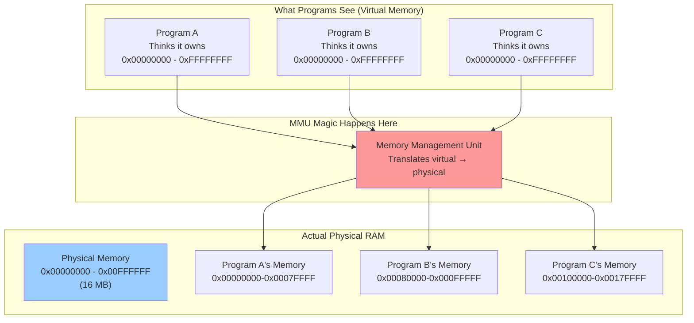
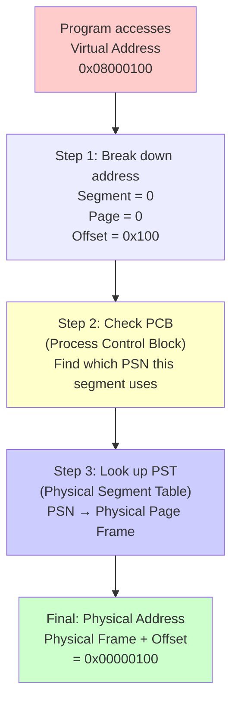
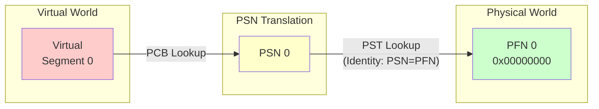
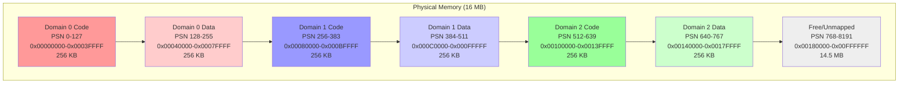
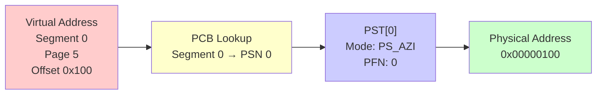
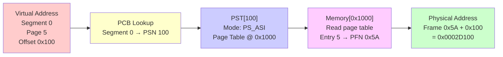
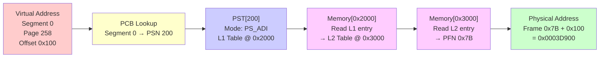
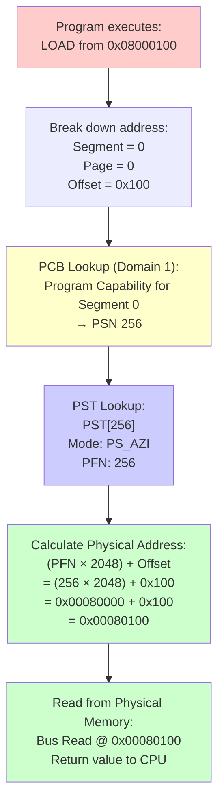

# ND-500 MMU Memory Allocation Deep Dive

**A Complete Guide to Understanding Virtual Memory, Physical Memory, and Paging**

## Table of Contents

1. [Introduction: Why Do We Need an MMU?](#introduction-why-do-we-need-an-mmu)
2. [The Big Picture: Virtual vs Physical Memory](#the-big-picture-virtual-vs-physical-memory)
3. [Basic Concepts and Terminology](#basic-concepts-and-terminology)
4. [The Three-Level Address Translation System](#the-three-level-address-translation-system)
5. [Memory Allocation Algorithm](#memory-allocation-algorithm)
6. [The Three Paging Modes Explained](#the-three-paging-modes-explained)
7. [Complete Example: Following a Memory Access](#complete-example-following-a-memory-access)
8. [Implementation in the Emulator](#implementation-in-the-emulator)

---

## Introduction: Why Do We Need an MMU?

Imagine you're running multiple programs on a computer. Without an MMU (Memory Management Unit), every program would need to know exactly where in physical memory it's located. This creates problems:

- **Program A** might accidentally overwrite **Program B**'s data
- Programs can't be moved in memory (they're hard-coded to specific addresses)
- You can't run a program that needs 1GB of memory if you only have 512MB

The MMU solves these problems by creating **virtual memory** - each program thinks it has its own private memory space starting at address 0, but the MMU secretly translates these addresses to actual physical memory locations.

Think of it like apartment buildings:
- **Virtual addresses**: Room numbers (101, 102, 103...)
- **Physical addresses**: Actual GPS coordinates
- **MMU**: The building directory that translates room numbers to real locations

---

## The Big Picture: Virtual vs Physical Memory



---

## Basic Concepts and Terminology

### Memory Units

The ND-500 divides memory into chunks:

| Unit | Size | Description |
|------|------|-------------|
| **Byte** | 1 byte | Smallest addressable unit |
| **Page** | 2,048 bytes (2 KB) | Basic unit of memory allocation |
| **Segment** | 128 MB | Large virtual address range (65,536 pages) |

Think of it like:
- **Byte** = a single letter
- **Page** = a page in a book (2KB of text)
- **Segment** = an entire library shelf (128MB worth of pages)

### Key Constants

```c
#define NBPG     2048    // Number of Bytes Per paGe
#define PGSHIFT  11      // Page address shift (2^11 = 2048)
#define SGSHIFT  27      // Segment address shift (2^27 = 128MB)
#define MAX_PST  8192    // Maximum Physical Segment Table entries
#define MAXDOM   256     // Maximum domains (isolated programs)
#define MAXSEG   32      // Maximum segments per domain
```

### Domains: Isolated Program Spaces

A **domain** is like a separate apartment - programs in different domains can't see each other's memory:

- **Domain 0**: Usually the operating system (kernel)
- **Domain 1**: User program A
- **Domain 2**: User program B
- ... up to 256 domains total

---

## The Three-Level Address Translation System

The ND-500 uses a three-step process to translate virtual addresses to physical addresses:



### Detailed Breakdown

#### Virtual Address Structure

A 32-bit virtual address is divided into three parts:

```
┌─────────┬──────────────────┬─────────────┐
│ Segment │       Page       │   Offset    │
│ 5 bits  │     16 bits      │   11 bits   │
│ (0-31)  │   (0-65535)      │  (0-2047)   │
└─────────┴──────────────────┴─────────────┘
   27-31        11-26             0-10

Example: 0x08000100
Binary: 00000000 01000000 00000001 00000000

Segment = 00000 = 0
Page    = 0000000001000000 = 64
Offset  = 00100000000 = 256 (0x100)
```

#### PCB (Process Control Block): The Directory

Each domain has a PCB that acts like a phone book - it tells you which PSN (Physical Segment Number) handles each virtual segment:

```
Domain 0 PCB:
  Segment 0 (code) → PSN 0
  Segment 1 (code) → PSN 1
  ...
  Segment 0 (data) → PSN 128
  Segment 1 (data) → PSN 129
```

#### PST (Physical Segment Table): The Map

The PST is the master map that translates PSN to actual physical memory locations:

```
PST[0]   → Physical Page Frame 0   (0x00000000-0x000007FF)
PST[1]   → Physical Page Frame 1   (0x00000800-0x00000FFF)
PST[128] → Physical Page Frame 128 (0x00040000-0x000407FF)
...
```

---

## Memory Allocation Algorithm

### The Identity Mapping Strategy

Our emulator uses **identity mapping** for simplicity: **PSN = PFN** (Physical Segment Number equals Page Frame Number)

This means:
- PSN 0 maps to physical page frame 0 (address 0x00000000)
- PSN 127 maps to physical page frame 127 (address 0x0003F800)
- PSN 256 maps to physical page frame 256 (address 0x00080000)



### Block Partitioning: Fair Share for Each Domain

Each domain gets **256 PSNs** divided into:
- **128 PSNs for code** (program instructions)
- **128 PSNs for data** (variables, heap, stack)

Total memory per domain: 256 PSNs × 2KB = **512 KB**



### PSN Allocation Formula

The formula to calculate which PSN a domain gets:

```
PSN = (domain_number × 256) + (code_or_data × 128) + segment_number
```

Where:
- `domain_number`: 0, 1, 2, ... (which program)
- `code_or_data`: 0 for code, 1 for data
- `segment_number`: 0-127 (which segment within the domain)

**Examples:**

| Domain | Type | Segment | Calculation | PSN | Physical Address |
|--------|------|---------|-------------|-----|------------------|
| 0 (Kernel) | Code | 0 | (0×256) + (0×128) + 0 | **0** | 0x00000000 |
| 0 (Kernel) | Data | 0 | (0×256) + (1×128) + 0 | **128** | 0x00040000 |
| 1 (User1) | Code | 5 | (1×256) + (0×128) + 5 | **261** | 0x00082800 |
| 1 (User1) | Data | 10 | (1×256) + (1×128) + 10 | **394** | 0x000C5000 |
| 2 (User2) | Code | 0 | (2×256) + (0×128) + 0 | **512** | 0x00100000 |
| 2 (User2) | Data | 127 | (2×256) + (1×128) + 127 | **767** | 0x0017F800 |

---

## The Three Paging Modes Explained

The ND-500 supports three different **index modes** that control how PST entries are interpreted:

### Mode 1: PS_AZI (Direct Paging - Zero Indirection)

**What it means:** The PST entry directly contains the physical page frame number.

**How it works:**



**Real-world analogy:** Like a speed-dial button - press 1, immediately call Mom. No looking up phone numbers.

**Code example:**
```c
nd500_mmu_set_pst_entry(cpu, 0, PS_AZI, 42);
// PSN 0 directly maps to physical frame 42
// Virtual page → PST lookup → Frame 42 (DONE!)
```

**Performance:** ⚡⚡⚡ Fastest (0 memory reads)

**When to use:**
- Small address spaces
- Simple identity mapping
- Maximum performance

---

### Mode 2: PS_ASI (Single-Level Paging - One Indirection)

**What it means:** The PST entry contains a pointer to a page table in memory. That page table contains the actual physical frame number.

**How it works:**



**Real-world analogy:** Like a hotel - you ask the front desk (PST) which floor (page table address), then look at the floor directory (page table) to find room 5 (PFN).

**Memory layout example:**
```
PST[100]:
  Mode: PS_ASI
  Page Table Address: 0x1000

Physical Memory at 0x1000 (the page table):
  [0x1000 + 0] = 0x20  (virtual page 0 → frame 0x20)
  [0x1000 + 1] = 0x21  (virtual page 1 → frame 0x21)
  [0x1000 + 2] = 0x00  (virtual page 2 → unmapped)
  [0x1000 + 3] = 0x22  (virtual page 3 → frame 0x22)
  [0x1000 + 4] = 0x00  (virtual page 4 → unmapped)
  [0x1000 + 5] = 0x5A  (virtual page 5 → frame 0x5A) ← We read this!
```

**Performance:** ⚡⚡ Medium (1 memory read)

**When to use:**
- Sparse virtual address spaces (lots of unmapped holes)
- Dynamic memory allocation
- Processes that map/unmap pages frequently

---

### Mode 3: PS_ADI (Two-Level Paging - Two Indirections)

**What it means:** The PST entry points to a level-1 page table, which points to a level-2 page table, which finally contains the physical frame number.

**How it works:**



**Real-world analogy:** Like a large university campus - you ask the main directory (PST) which building (L1 table), then check the building directory (L1) for which floor (L2 table), then check the floor directory (L2) for the actual room number (PFN).

**Memory layout example:**
```
PST[200]:
  Mode: PS_ADI
  L1 Page Table Address: 0x2000

Physical Memory at 0x2000 (Level 1 page table):
  [0x2000 + 0] = 0x3000  (virtual pages 0-255 → L2 table @ 0x3000)
  [0x2000 + 1] = 0x3100  (virtual pages 256-511 → L2 table @ 0x3100)
  [0x2000 + 2] = 0x0000  (virtual pages 512-767 → unmapped)

Physical Memory at 0x3100 (Level 2 page table for pages 256-511):
  [0x3100 + 0] = 0x7A  (virtual page 256 → frame 0x7A)
  [0x3100 + 1] = 0x00  (virtual page 257 → unmapped)
  [0x3100 + 2] = 0x7B  (virtual page 258 → frame 0x7B) ← We read this!
```

**Performance:** ⚡ Slow (2 memory reads)

**When to use:**
- Very large virtual address spaces (gigabytes)
- Operating systems with complex virtual memory
- Multi-level hierarchical memory management

---

## Complete Example: Following a Memory Access

Let's trace a complete memory access from start to finish.

### Scenario Setup

- **Current Domain:** 1 (User program)
- **Virtual Address:** 0x08000100
- **MMU Configuration:** PS_AZI mode (direct mapping)

### Step-by-Step Translation



### Detailed Walkthrough

#### Step 1: Parse Virtual Address

```
Virtual Address: 0x08000100
Binary: 00000000 01000000 00000001 00000000

Extract fields:
  Segment = bits 27-31 = 00000 = 0
  Page    = bits 11-26 = 0000000001000000 = 64... wait, let me recalculate:

Actually for address 0x08000100:
  Segment = 0x08000100 >> 27 = 0
  Page    = (0x08000100 >> 11) & 0xFFFF = 0
  Offset  = 0x08000100 & 0x7FF = 0x100 (256 decimal)
```

#### Step 2: PCB Lookup

```c
// We're in Domain 1, accessing Segment 0
uint16_t pc = nd500_mmu_get_program_capability(cpu, domain=1, segment=0);
// Returns: (256 + 0) | PC_DIR = 256

PSN = pc & PC_PSN = 256
```

#### Step 3: PST Lookup

```c
PhysicalSegmentTableEntry pst = nd500_mmu_get_pst_entry(cpu, psn=256);
// Returns:
//   index_mode = PS_AZI
//   physical_pfn = 256
```

#### Step 4: Calculate Physical Address

```c
// For PS_AZI mode (direct):
uint32_t physical_frame = pst.physical_pfn;  // 256
uint32_t physical_address = (physical_frame << PGSHIFT) | offset;
//                         = (256 << 11) | 0x100
//                         = 0x00080000 | 0x100
//                         = 0x00080100
```

#### Step 5: Access Physical Memory

```c
uint8_t value = nd500_bus_read8(machine, 0x00080100);
// Reads byte from physical RAM at address 0x00080100
```

**Success!** Virtual address 0x08000100 in Domain 1 → Physical address 0x00080100

---

## Implementation in the Emulator

### The mmusetup Command

The `mmusetup` debugger command creates a 3-domain demonstration configuration:

**What it does:**
1. Creates 768 PST entries (256 per domain)
2. Uses identity mapping (PSN = PFN)
3. Configures PCB capabilities for all 3 domains
4. Enables the MMU

**Code location:** `/home/ronny/repos/nd500x/src/debugger/commands.c` (lines 1196-1277)

### PST Configuration

```c
/* Domain 0 (Kernel) Code: PSN 0-127 → Physical 0x00000000-0x0003FFFF */
for (uint32_t i = 0; i < 128; i++) {
    nd500_mmu_set_pst_entry(m->cpu, i, PS_AZI, i);  // Identity: PFN = PSN
}

/* Domain 0 (Kernel) Data: PSN 128-255 → Physical 0x00040000-0x0007FFFF */
for (uint32_t i = 128; i < 256; i++) {
    nd500_mmu_set_pst_entry(m->cpu, i, PS_AZI, i);
}

/* Domain 1 (User1) Code: PSN 256-383 → Physical 0x00080000-0x000BFFFF */
for (uint32_t i = 256; i < 384; i++) {
    nd500_mmu_set_pst_entry(m->cpu, i, PS_AZI, i);
}

/* ... and so on for Domain 1 Data, Domain 2 Code, Domain 2 Data */
```

### PCB Configuration

```c
/* Domain 0 (Kernel) - Program Capabilities */
for (uint32_t seg = 0; seg < 128; seg++) {
    // PSN = (domain × 256) + (code × 128) + segment
    //     = (0 × 256) + (0 × 128) + seg = seg
    nd500_mmu_set_program_capability(m->cpu, 0, seg, seg | PC_DIR);
}

/* Domain 0 (Kernel) - Data Capabilities */
for (uint32_t seg = 0; seg < 128; seg++) {
    // PSN = (domain × 256) + (data × 128) + segment
    //     = (0 × 256) + (1 × 128) + seg = 128 + seg
    nd500_mmu_set_data_capability(m->cpu, 0, seg, (128 + seg));
}

/* Domain 1 (User1) - Program Capabilities */
for (uint32_t seg = 0; seg < 128; seg++) {
    // PSN = (1 × 256) + (0 × 128) + seg = 256 + seg
    nd500_mmu_set_program_capability(m->cpu, 1, seg, (256 + seg) | PC_DIR);
}

/* ... and so on for Domain 1 Data, Domain 2 */
```

### Memory Map Visualization

The `nd500_dbg_memory_map_json()` function generates a JSON representation of memory usage:

**Code location:** `/home/ronny/repos/nd500x/src/machine/memory_map.c`

**Algorithm:**
1. Scan all 8,192 PST entries
2. For each configured entry, find which domain/segment uses it
3. Calculate physical address range (PFN × 2KB)
4. Sort by physical address
5. Generate JSON with blocks array

**Example output:**
```json
{
  "total_memory": 16777216,
  "blocks": [
    {
      "phys_start": 0,
      "phys_end": 2048,
      "size": 2048,
      "domain": 0,
      "segment": 0,
      "virtual_start": 0,
      "psn": 0,
      "mode": "AZI",
      "writable": true,
      "public": false
    },
    {
      "phys_start": 2048,
      "phys_end": 4096,
      "size": 2048,
      "domain": 0,
      "segment": 1,
      "virtual_start": 134217728,
      "psn": 1,
      "mode": "AZI",
      "writable": true,
      "public": false
    }
  ]
}
```

### WebAssembly Integration

The WASM build exports `nd500_dbg_memory_map_json_js()` to JavaScript:

**Frontend visualization:** `/home/ronny/repos/nd500x/src/frontend/nd500wasm/web/debugger.js`

The web debugger displays memory as colored 2KB blocks:
- **Red**: Domain 0 (Kernel)
- **Blue**: Domain 1 (User1)
- **Green**: Domain 2 (User2)
- **Gray**: Free/unmapped

---

## Summary

The ND-500 MMU provides sophisticated virtual memory management through:

1. **Three-level translation**: Virtual Address → PCB → PST → Physical Address
2. **Domain isolation**: Each program gets its own protected address space
3. **Flexible paging modes**: PS_AZI (direct), PS_ASI (single-level), PS_ADI (two-level)
4. **Block partitioning**: Fair allocation of PSNs to domains using a simple formula

Our emulator implementation uses **identity mapping (PSN = PFN)** with **PS_AZI mode** for simplicity and maximum performance. This creates a straightforward mapping that's easy to understand and debug, while still demonstrating all the key MMU concepts.

The system is designed to be extensible - real ND-500 operating systems like Sintran would use PS_ASI or PS_ADI modes for more sophisticated memory management with demand paging, copy-on-write, and memory-mapped files.

---

**Document Version:** 1.0
**Last Updated:** 2025-10-16
**Author:** Technical Documentation
