# CALL and Entry Point Instructions: Parameter Passing Explained

## Overview

The ND-500 calling convention uses a two-instruction protocol where **CALL/CALLG** (caller) and **ENTR** (callee) instructions work together to pass parameters and set up the subroutine's local data area (stack frame).

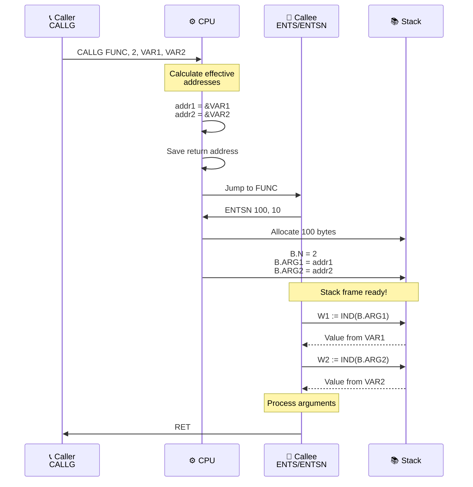

## Key Concept: Address-Based Parameter Passing

**CRITICAL:** The ND-500 does NOT pass parameter *values* - it passes parameter *addresses* (pointers).

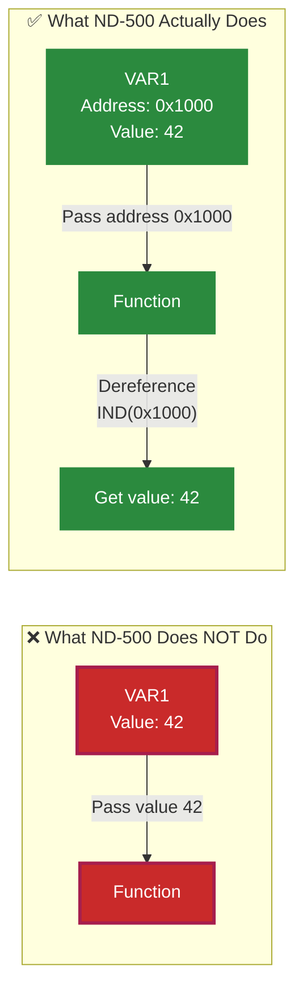

**This is why:**
- Arguments must be memory locations (not registers or constants)
- Arguments are always interpreted as word addresses
- The callee accesses parameters by dereferencing these addresses

---

## Understanding IND() - Indirect Addressing

**IND() is NOT an instruction** - it's an **addressing mode notation** that means "dereference" or "indirect addressing."

### What is IND()?

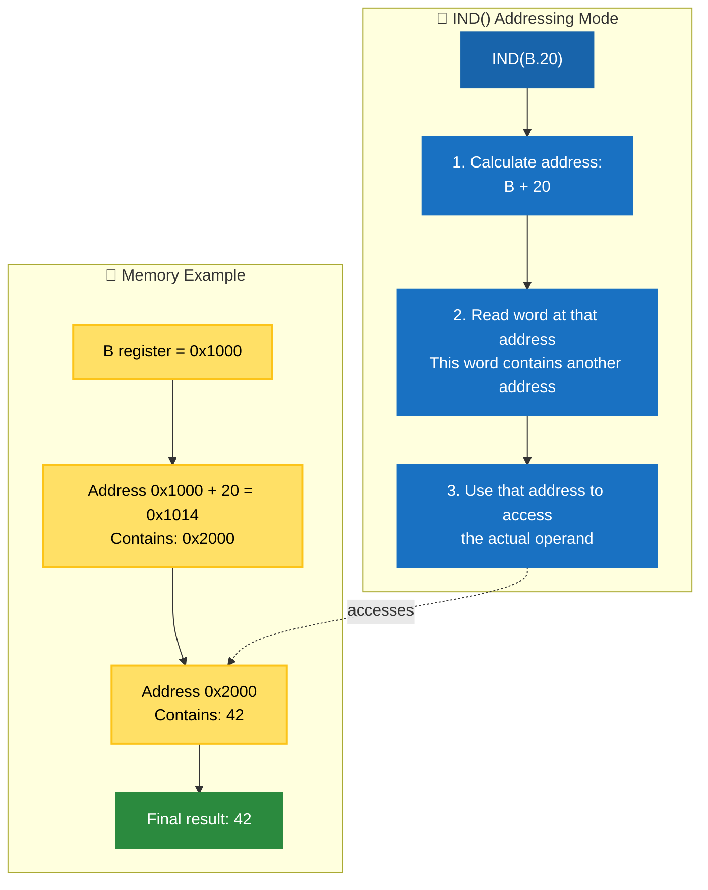

### Mathematical Formula

**Effective Address Calculation:**
```
ea = ((B) + displacement)
```

This means:
1. Take the value in B register
2. Add the displacement
3. **Read the word at that address** (this is the indirection!)
4. The word you just read IS the effective address

### Syntax Variants

| Assembly Notation | Name | Hex Code | Displacement Size |
|-------------------|------|----------|-------------------|
| `IND(B.disp)` | Indirect | - | Auto-sized |
| `IND(B.disp:B)` | Indirect, byte displacement | 0xC5 | 1 byte (0-255) |
| `IND(B.disp:H)` | Indirect, halfword displacement | 0xC6 | 2 bytes (0-65535) |
| `IND(B.disp:W)` | Indirect, word displacement | 0xC7 | 4 bytes (full 32-bit) |

### Why Use IND()? Call-By-Reference!

This is **exactly** why arguments work in ND-500:

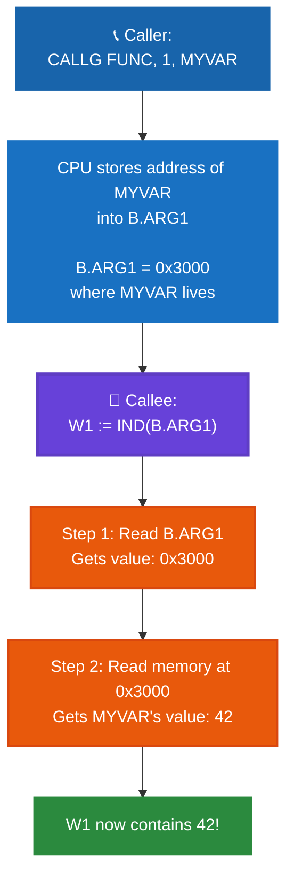

### Concrete Example

```asm
; Setup
MYVAR:  .WORD   42          ; MYVAR is at address 0x3000, contains 42

; Caller
CALLG FUNC, 1, MYVAR         ; Passes address 0x3000

; Callee
FUNC:
    ENTSN 40, 1

    ; B.ARG1 now contains 0x3000 (the address of MYVAR)

    ; WITHOUT IND() - WRONG!
    W1 := B.ARG1             ; W1 = 0x3000 (the address, not the value!)

    ; WITH IND() - CORRECT!
    W1 := IND(B.ARG1)        ; W1 = 42 (the actual value at 0x3000)

    RET
```

### IND() is an Addressing Mode, Not an Opcode

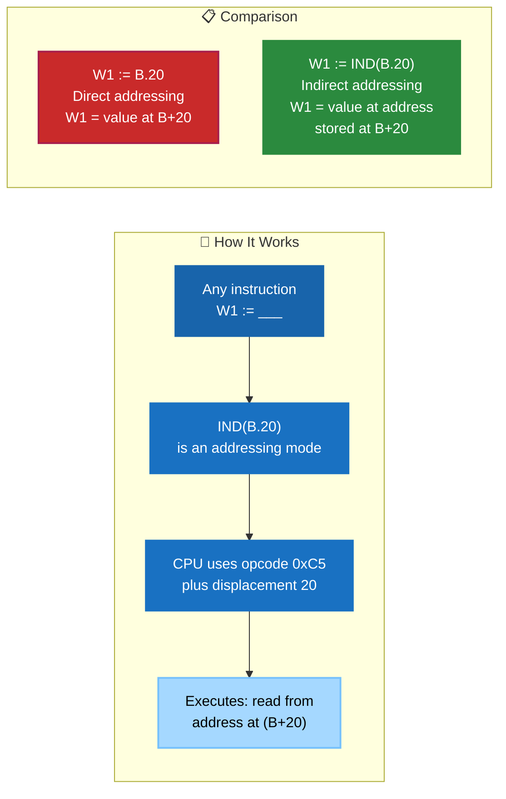

**Key Points:**
1. **IND() is assembly syntax** for indirect addressing mode
2. **The CPU uses a special opcode** (0xC5, 0xC6, 0xC7) to encode it
3. **It's a two-step memory access:**
   - First read: get the address
   - Second read: get the value at that address
4. **Essential for call-by-reference** semantics

### Other Addressing Modes with IND()

IND() can be combined with post-indexing for array access through pointers:

| Assembly Notation | Name | Formula |
|-------------------|------|---------|
| `IND(B.20)(R1)` | Indirect, post-indexed | `ea = ((B)+20) + scale*(R1)` |
| `IND(B.20:B)(R1)` | Indirect, post-indexed, byte disp | `ea = ((B)+20) + scale*(R1)` |

**Example:**
```asm
; B.ARG1 contains address of an array
; R1 contains index
W1 := IND(B.ARG1)(R1)        ; W1 = array[R1]
```

This does:
1. Read address from B.ARG1 (let's say 0x5000)
2. Calculate: 0x5000 + 4*R1 (assuming word-sized elements)
3. Read value at that address

### Summary

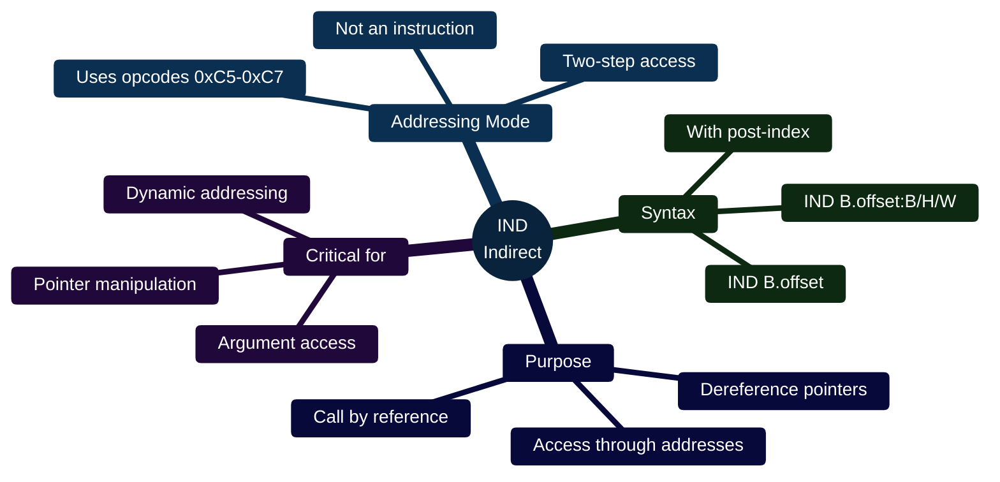

---

## CALL/CALLG Instructions (Caller Side)

### Format

```
CALL  <subr_addr>, <no_of_args>, <arg1>, <arg2>, ..., <argn>
CALLG <subr_addr>, <no_of_args>, <arg1>, <arg2>, ..., <argn>
```

### Parameters Explained

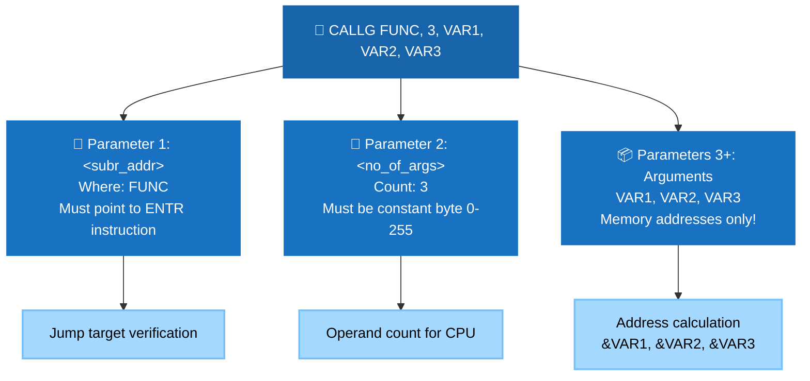

**Parameter 1: `<subr_addr>`** - Subroutine Address
- **CALL**: Direct 4-byte absolute address in the instruction
- **CALLG**: General operand (can be register, local variable, etc.)
- **Must point to an ENTR instruction** (ENTS, ENTSN, ENTF, ENTFN, ENTB, etc.)
- If it doesn't point to an entry instruction → **Instruction Sequence Error trap**

**Parameter 2: `<no_of_args>`** - Number of Arguments
- **Must be a constant byte** (0-255)
- Tells the entry point how many argument addresses follow
- Non-constant values → **Illegal Operand Specifier trap**

**Parameters 3+: `<arg1>`, `<arg2>`, ..., `<argn>`** - Argument Addresses
- **Not actual values, but ADDRESSES** of the arguments
- Must be memory locations (cannot be registers or constants)
- Always interpreted as **word addresses** regardless of actual data type
- Each argument's **effective address** is calculated and stored
- These addresses are passed to the callee via the stack

### What CALL/CALLG Does

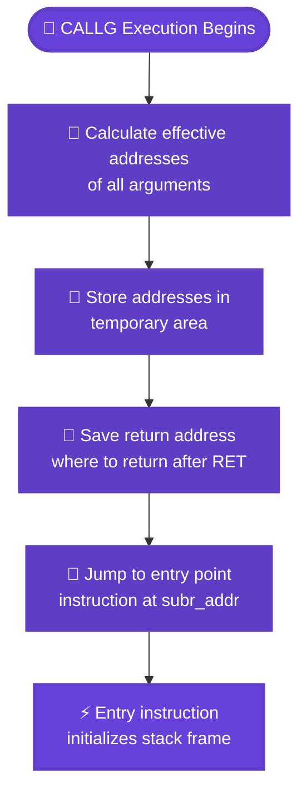

---

## ENTR Instructions (Callee Side)

There are multiple entry point types, each with different stack frame initialization:

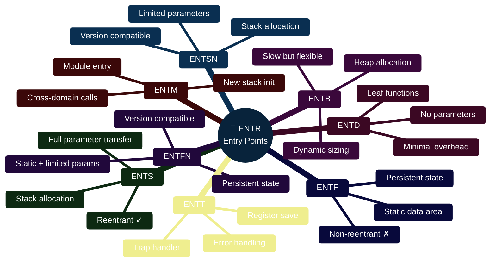

### Entry Point Types

| Entry Point | Parameters | Purpose |
|-------------|------------|---------|
| **ENTS** 🔵 | `<stack_demand>` | Standard stack-based subroutine |
| **ENTSN** 🟢 | `<stack_demand>`, `<max_args>` | Stack subroutine with argument limit |
| **ENTF** 🟡 | `<address_of_data_area>` | Fixed (static) data area |
| **ENTFN** 🟠 | `<address_of_data_area>`, `<max_args>` | Fixed data area with argument limit |
| **ENTB** 🔴 | `<log_size>` | Heap-allocated block |
| **ENTD** ⚡ | `<stack_demand>` | Direct entry (no parameter transfer) |
| **ENTM** 🌐 | `<bottom>`, `<main_demand>`, `<total_demand>` | Module entry (new stack) |
| **ENTT** ⚠️ | `<main_demand>`, `<total_demand>` | Trap handler entry |

---

## ENTS/ENTSN - Stack Subroutine Entry

### ENTS Format
```
ENTS <stack_demand>
```

**Parameter: `<stack_demand>`** - Stack Space Required
- Number of **bytes** needed for the local data area
- Includes the 20-byte header (PREVB, RETA, SP, AUX, N)
- Plus space for all local variables
- Example: `ENTS 100` requests 100 bytes total

### ENTSN Format
```
ENTSN <stack_demand>, <max_no_of_args>
```

**Parameter 1: `<stack_demand>`** - Same as ENTS

**Parameter 2: `<max_no_of_args>`** - Argument Limit
- Maximum number of argument addresses to transfer
- If caller passes MORE arguments than this, extras are ignored
- If caller passes FEWER, all are transferred
- `B.N` contains the actual number transferred (min of caller's count and this limit)

### Stack Frame Layout Created by ENTS/ENTSN

```mermaid
graph TD
    subgraph "📚 Stack Frame Structure"
        direction TB
        B["🔵 B Register points here"]

        B --> B0["B+0: B.PREVB<br/>Previous B register value<br/>4 bytes"]
        B0 --> B4["B+4: B.RETA<br/>Return address<br/>also copied to L register<br/>4 bytes"]
        B4 --> B8["B+8: B.SP<br/>Stack pointer<br/>B + stack_demand<br/>4 bytes"]
        B8 --> B12["B+12: B.AUX/LOG<br/>Auxiliary location<br/>language-specific use<br/>4 bytes"]
        B12 --> B16["B+16: B.N<br/>Number of arguments<br/>transferred<br/>4 bytes"]
        B16 --> B20["B+20: B.ARG1<br/>📍 Address of arg1<br/>← from CALLER<br/>4 bytes"]
        B20 --> B24["B+24: B.ARG2<br/>📍 Address of arg2<br/>← from CALLER<br/>4 bytes"]
        B24 --> B28["B+28: B.ARG3<br/>📍 Address of arg3<br/>← from CALLER<br/>4 bytes"]
        B28 --> BN["B+20+4n: B.ARGn<br/>📍 More arguments...<br/>4 bytes each"]
        BN --> LOC["🔶 Local Variables<br/>uninitialized<br/>variable size"]
        LOC --> SP["B.SP →<br/>First free location"]
    end

    style B fill:#c92a2a,stroke:#a61e4d,stroke-width:4px,color:#fff
    style B0 fill:#ffc9c9,stroke:#ffa8a8,stroke-width:2px,color:#000
    style B4 fill:#ffc9c9,stroke:#ffa8a8,stroke-width:2px,color:#000
    style B8 fill:#ffc9c9,stroke:#ffa8a8,stroke-width:2px,color:#000
    style B12 fill:#ffc9c9,stroke:#ffa8a8,stroke-width:2px,color:#000
    style B16 fill:#b2f2bb,stroke:#2b8a3e,stroke-width:3px,color:#000
    style B20 fill:#2f9e44,stroke:#2b8a3e,stroke-width:3px,color:#fff
    style B24 fill:#2f9e44,stroke:#2b8a3e,stroke-width:3px,color:#fff
    style B28 fill:#2f9e44,stroke:#2b8a3e,stroke-width:3px,color:#fff
    style BN fill:#2f9e44,stroke:#2b8a3e,stroke-width:3px,color:#fff
    style LOC fill:#ffe066,stroke:#fcc419,stroke-width:2px,color:#000
    style SP fill:#1971c2,stroke:#1864ab,stroke-width:3px,color:#fff
```

**Key Point:** `B.ARG1`, `B.ARG2`, etc. contain the **addresses** that CALL calculated, NOT the values.

---

## ENTF/ENTFN - Fixed Data Area Entry

### ENTF Format
```
ENTF <address_of_local_data_area>
```

**Parameter: `<address_of_local_data_area>`**
- Direct 4-byte absolute address in the instruction
- Points to a **statically allocated** data area
- This area persists between calls (values retained)
- **Non-reentrant** (cannot be called recursively)

### ENTFN Format
```
ENTFN <address_of_local_data_area>, <max_no_of_args>
```

**Parameter 1: `<address_of_local_data_area>`** - Same as ENTF

**Parameter 2: `<max_no_of_args>`** - Same as ENTSN

### What ENTF/ENTFN Does


**Use Case:** Functions with persistent state (e.g., random number generator with seed)

---

## ENTB - Heap Block Entry

### Format
```
ENTB <log_size>
```

**Parameter: `<log_size>`**
- **Logarithm (base 2)** of the block size needed
- Allocates a block from the heap
- Block size = 2^(log_size) bytes
- Example: `ENTB 8` allocates 256 bytes (2^8)

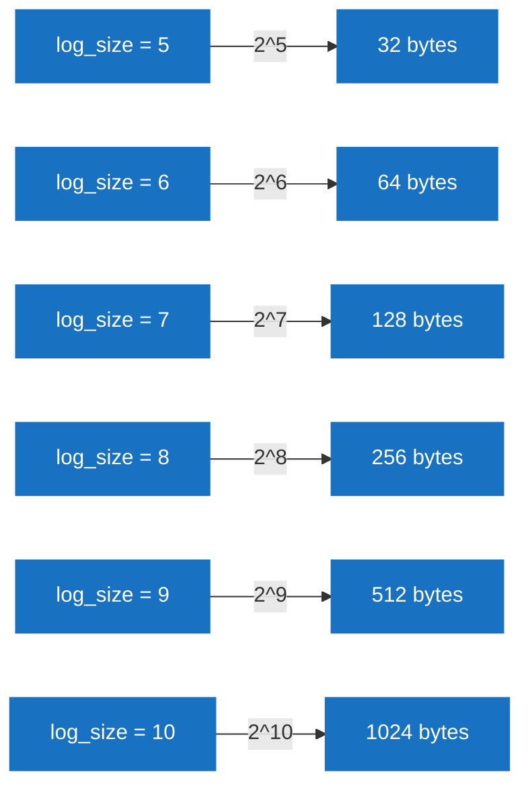

### What ENTB Does

1. Allocates a heap block of size 2^(log_size)
2. Sets B register to the block's address
3. Stores block size in `B.AUX`
4. Initializes stack frame (like ENTS)
5. Transfers argument addresses

**Use Case:** Variable-sized data structures, dynamic allocation

---

## ENTD - Direct Entry (No Parameters)

### Format
```
ENTD <stack_demand>
```

**Parameter: `<stack_demand>`** - Stack space (unused)

### What ENTD Does

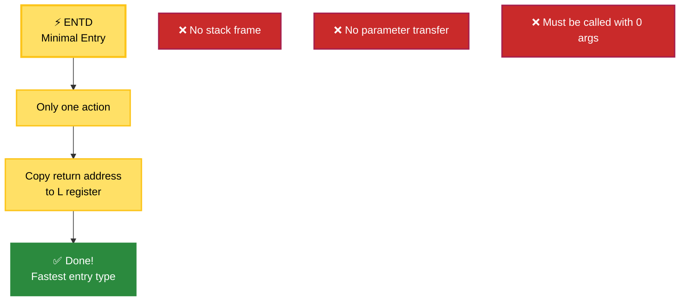

**MINIMAL SETUP:**
- Only copies return address to L register
- **No stack frame initialization**
- **No parameter transfer** (must be called with 0 arguments)
- Caller with arguments → **Instruction Sequence Error trap**

**Use Case:** Leaf functions with no parameters, no local variables

---

## Complete Example: Calling a Subroutine

### Scenario
Call a `PRINT` subroutine that formats and prints data.

### Caller Code
```asm
; Define some variables
UNIT:    .WORD   5          ; Output unit number
FORMAT:  .WORD   0x100      ; Format string address
VALUE:   .SPACE  4          ; Local variable on stack at B.16

; Call PRINT with 3 arguments
CALLG PRINT, 3, UNIT, FORMAT, B.VALUE
```

### Complete Call Flow Diagram

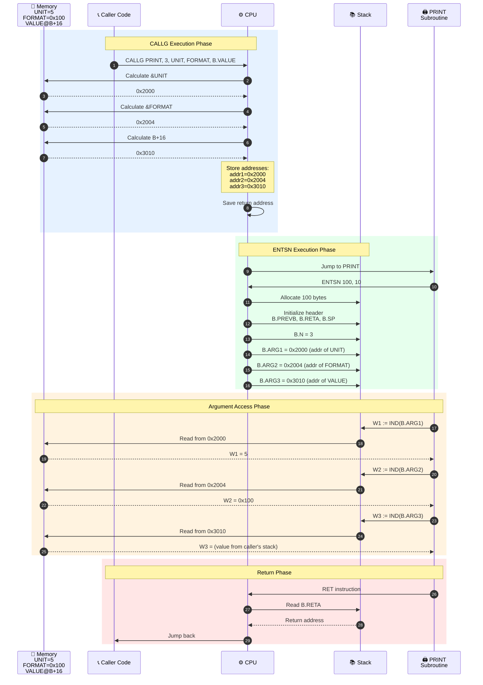

### Callee Code (PRINT subroutine)
```asm
PRINT:
    ENTSN 100, 10       ; Request 100 bytes, max 10 arguments

    ; Now the stack frame is set up:
    ; B.N = 3 (number of arguments)
    ; B.ARG1 = address of UNIT
    ; B.ARG2 = address of FORMAT
    ; B.ARG3 = address of VALUE (B+16 in caller's frame)

    ; Access the ACTUAL VALUES by dereferencing:
    W1 := IND(B.ARG1)   ; Load unit number (5) into W1
    W2 := IND(B.ARG2)   ; Load format address (0x100) into W2
    W3 := IND(B.ARG3)   ; Load value from caller's local var

    ; ... do printing ...

    RET                 ; Return to caller
```

### Address vs Value Visualization

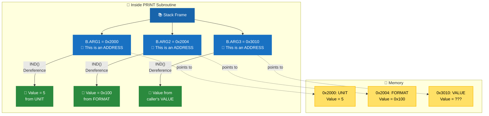

### Key Insight

The callee **must dereference** `B.ARG1`, `B.ARG2`, etc. using **IND()** to get the actual values:

- `B.ARG1` contains an address, NOT the value 5
- `IND(B.ARG1)` accesses the memory at that address to get 5
- This is **call by reference** semantics

---

## Why Two Parameters on CALL?

You might wonder: why does CALL need both `<no_of_args>` AND the argument list? Can't it just count?

### Reason 1: Variable-Length Encoding

The ND-500 has complex addressing modes. The CPU can't easily tell where one operand ends and the next begins without decoding each one. The `<no_of_args>` parameter tells the CPU exactly how many operands to decode.

### Reason 2: ENTSN/ENTFN Argument Limiting

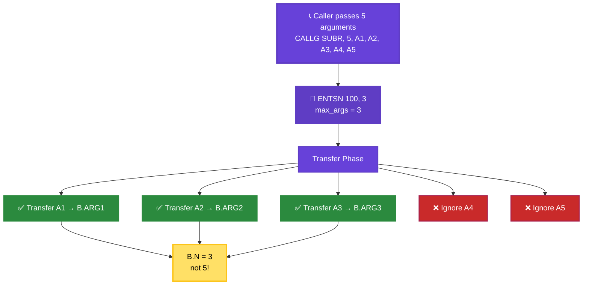

The `<max_no_of_args>` parameter on ENTSN/ENTFN allows the callee to limit how many arguments it accepts:

```asm
; Caller passes 5 arguments
CALLG SUBR, 5, ARG1, ARG2, ARG3, ARG4, ARG5

SUBR:
    ENTSN 100, 3        ; Only accept first 3 arguments
    ; B.N will be 3 (not 5)
    ; B.ARG1, B.ARG2, B.ARG3 are set
    ; ARG4 and ARG5 are ignored
```

This enables **versioning**: older code with fewer parameters can call newer functions that expect more, or vice versa.

---

## Argument Restrictions

### Cannot Use Registers or Constants

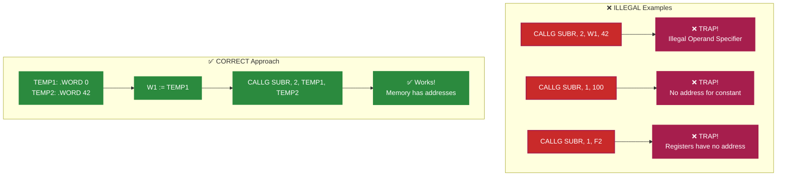

```asm
; ILLEGAL - Will cause trap!
CALLG SUBR, 2, W1, 42

; CORRECT - Use memory locations
TEMP1: .WORD 0
TEMP2: .WORD 42

W1 := TEMP1         ; Store W1's value to memory
CALLG SUBR, 2, TEMP1, TEMP2
```

**Why?** Because CALL passes *addresses*, and registers/constants don't have addresses.

### Data Type Considerations

All argument addresses are treated as **word addresses**. If you're using post-indexed or descriptor addressing with non-word data types, be careful:

```asm
ARRAY:  .BYTE 10, 20, 30, 40

; This might not work as expected:
CALLG SUBR, 1, ARRAY(W1)   ; Index calculated for words, not bytes!

; Better:
BY1 := ARRAY           ; Use proper byte addressing
CALLG SUBR, 1, TEMP    ; Pass address of result
```

---

## Entry Point Mismatches

### Error Detection

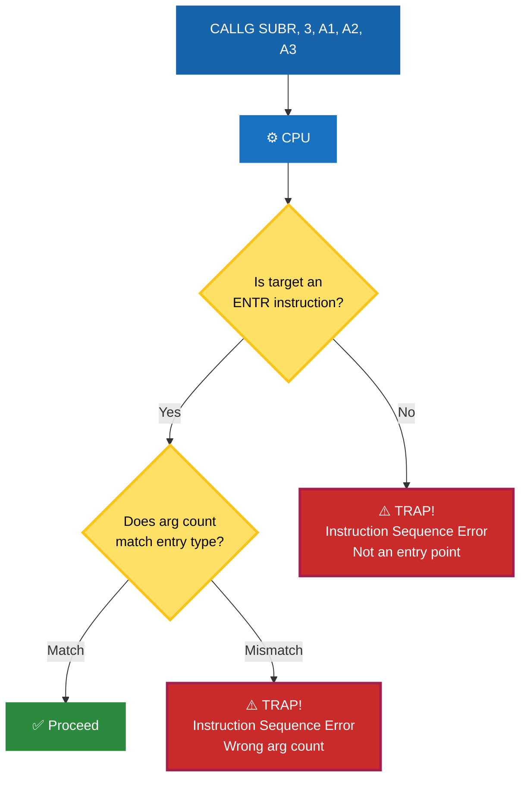

### What Happens If You Call The Wrong Entry Point?

The CPU detects entry point mismatches at runtime:

```asm
; Caller expects a function with parameters
CALLG SUBR, 3, ARG1, ARG2, ARG3

SUBR:
    ENTD            ; ERROR: ENTD requires 0 arguments!
    ; → Instruction Sequence Error trap
```

### Not An Entry Point At All

```asm
CALLG LABEL, 0, ; LABEL doesn't point to an ENTx instruction

LABEL:
    W1 + 1          ; This is not an entry point!
    ; → Instruction Sequence Error trap
```

---

## Summary Table: Parameter Usage

| Instruction | Parameters | Who Uses Them | Purpose |
|-------------|------------|---------------|---------|
| **CALL/CALLG** | `<subr_addr>` | CPU | Jump target (must be ENTR instruction) |
| | `<no_of_args>` | CPU | How many argument addresses follow |
| | `<arg1>`...`<argn>` | CPU calculates addresses → stored → callee reads from stack | Data passed to callee |
| **ENTS** | `<stack_demand>` | CPU | Allocate stack frame of this size |
| **ENTSN** | `<stack_demand>` | CPU | Allocate stack frame of this size |
| | `<max_no_of_args>` | CPU | Transfer at most this many argument addresses |
| **ENTF** | `<data_area_addr>` | CPU | Use this static area instead of stack |
| **ENTFN** | `<data_area_addr>` | CPU | Use this static area instead of stack |
| | `<max_no_of_args>` | CPU | Transfer at most this many argument addresses |
| **ENTB** | `<log_size>` | CPU | Allocate heap block of 2^(log_size) bytes |
| **ENTD** | `<stack_demand>` | (ignored) | No parameter transfer, caller must pass 0 args |

---

## Accessing Arguments in the Callee

Inside the subroutine, access arguments through the B register:

```mermaid
graph TD
    subgraph "Method 1: Direct Indexed Access"
        M1A["W1 := IND(B.20)"] --> M1B["B.N - number of args"]
        M1C["W2 := IND(B.24)"] --> M1D["B.ARG1 - first arg"]
        M1E["W3 := IND(B.28)"] --> M1F["B.ARG2 - second arg"]
    end

    subgraph "Method 2: Named Access"
        M2A["Define: N = 20<br/>ARG1 = 24<br/>ARG2 = 28"] --> M2B["W1 := IND(B.N)"]
        M2B --> M2C["W2 := IND(B.ARG1)"]
        M2C --> M2D["W3 := IND(B.ARG2)"]
    end

    subgraph "Method 3: Two-Step"
        M3A["W1 := B.ARG1"] --> M3B["W1 = address"]
        M3B --> M3C["W2 := IND(W1)"]
        M3C --> M3D["W2 = value"]
    end

    style M1A fill:#1864ab,stroke:#1864ab,stroke-width:2px,color:#fff
    style M1C fill:#1864ab,stroke:#1864ab,stroke-width:2px,color:#fff
    style M1E fill:#1864ab,stroke:#1864ab,stroke-width:2px,color:#fff
    style M2A fill:#2b8a3e,stroke:#2b8a3e,stroke-width:2px,color:#fff
    style M2B fill:#2b8a3e,stroke:#2b8a3e,stroke-width:2px,color:#fff
    style M2C fill:#2b8a3e,stroke:#2b8a3e,stroke-width:2px,color:#fff
    style M2D fill:#2b8a3e,stroke:#2b8a3e,stroke-width:2px,color:#fff
    style M3A fill:#e8590c,stroke:#d9480f,stroke-width:2px,color:#fff
    style M3B fill:#e8590c,stroke:#d9480f,stroke-width:2px,color:#fff
    style M3C fill:#e8590c,stroke:#d9480f,stroke-width:2px,color:#fff
    style M3D fill:#e8590c,stroke:#d9480f,stroke-width:2px,color:#fff
```

### Method 1: Direct Indexed Access
```asm
SUBR:
    ENTSN 100, 10

    W1 := IND(B.20)     ; B.N (number of args)
    W2 := IND(B.24)     ; B.ARG1 (first argument address)
    W3 := IND(B.28)     ; B.ARG2 (second argument address)
```

### Method 2: Named Access (Assembler Macros)
```asm
; Define symbolic offsets (typically done by compiler)
N     = 20      ; Offset to B.N
ARG1  = 24      ; Offset to B.ARG1
ARG2  = 28      ; Offset to B.ARG2

SUBR:
    ENTSN 100, 10

    W1 := IND(B.N)      ; Number of arguments
    W2 := IND(B.ARG1)   ; First argument address
    W3 := IND(B.ARG2)   ; Second argument address
```

### Method 3: Load and Dereference
```asm
SUBR:
    ENTSN 100, 10

    ; Get address of first argument
    W1 := B.ARG1        ; W1 = address

    ; Dereference to get value
    W2 := IND(W1)       ; W2 = value at that address

    ; Or in one step:
    W3 := IND(B.ARG1)   ; Direct dereference
```

---

## Real-World Example: String Copy Function

### Complete strcpy Implementation

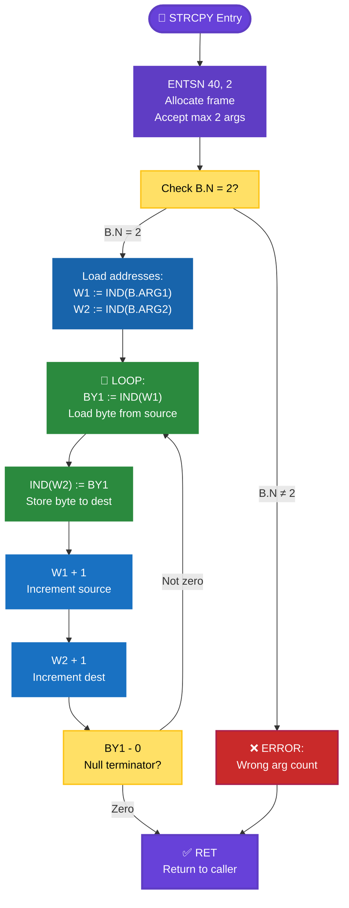

### Caller
```asm
SOURCE: .ASCII "Hello, World!"
DEST:   .SPACE 20

; Call strcpy with 2 arguments
CALLG STRCPY, 2, SOURCE, DEST
```

### Callee (strcpy implementation)
```asm
STRCPY:
    ENTSN 40, 2         ; 40 bytes local space, max 2 args

    ; Check we got 2 arguments
    W1 := IND(B.N)
    W1 - 2              ; Compare with 2
    IF != GO ERROR

    ; Load argument addresses
    W1 := IND(B.ARG1)   ; W1 = address of SOURCE
    W2 := IND(B.ARG2)   ; W2 = address of DEST

    ; Now copy string (pseudocode)
LOOP:
    BY1 := IND(W1)      ; Load byte from source
    IND(W2) := BY1      ; Store byte to dest
    W1 + 1              ; Increment source pointer
    W2 + 1              ; Increment dest pointer
    BY1 - 0             ; Test for null terminator
    IF != GO LOOP

    RET                 ; Return to caller

ERROR:
    ; Handle wrong number of arguments
    RET
```

---

## Common Pitfalls

### 1. Forgetting to Dereference

```mermaid
graph LR
    subgraph "❌ WRONG"
        W1["W1 := B.ARG1<br/>W2 := B.ARG2"] --> W2["W1 - W2"]
        W2 --> W3["Compares ADDRESSES<br/>not values!"]
    end

    subgraph "✅ CORRECT"
        C1["W1 := IND(B.ARG1)<br/>W2 := IND(B.ARG2)"] --> C2["W1 - W2"]
        C2 --> C3["Compares VALUES<br/>at those addresses"]
    end

    style W1 fill:#c92a2a,stroke:#a61e4d,stroke-width:2px,color:#fff
    style W2 fill:#c92a2a,stroke:#a61e4d,stroke-width:2px,color:#fff
    style W3 fill:#a61e4d,stroke:#a61e4d,stroke-width:3px,color:#fff
    style C1 fill:#2b8a3e,stroke:#2b8a3e,stroke-width:2px,color:#fff
    style C2 fill:#2b8a3e,stroke:#2b8a3e,stroke-width:2px,color:#fff
    style C3 fill:#2b8a3e,stroke:#2b8a3e,stroke-width:3px,color:#fff
```

```asm
; WRONG - Compares addresses, not values!
W1 := B.ARG1
W2 := B.ARG2
W1 - W2             ; Compares the addresses themselves

; CORRECT - Compares values
W1 := IND(B.ARG1)
W2 := IND(B.ARG2)
W1 - W2             ; Compares the values at those addresses
```

### 2. Using Wrong Stack Demand

```asm
SUBR:
    ; Need: 20 (header) + 16 (4 local words) = 36 bytes
    ENTS 36             ; CORRECT

    ; WRONG - Only allocates header!
    ENTS 20             ; Local variables will corrupt stack!
```

### 3. Passing Too Many Arguments with ENTSN

```asm
; Caller passes 10 arguments
CALLG SUBR, 10, A1, A2, A3, A4, A5, A6, A7, A8, A9, A10

SUBR:
    ENTSN 100, 5        ; Only accept 5 arguments

    ; B.N = 5 (not 10)
    ; Only B.ARG1 through B.ARG5 are valid
    ; Accessing B.ARG6+ will read uninitialized memory!
```

### 4. Modifying Caller's Data Unintentionally

```mermaid
graph TD
    Caller["📞 Caller<br/>VAR = 100"] --> Call["CALLG FUNC, 1, VAR"]
    Call --> Func["🎯 Function"]
    Func --> Load["W1 := IND(B.ARG1)<br/>W1 = address of VAR"]
    Load --> Mod["W2 := 999<br/>IND(W1) := W2"]
    Mod --> Ret["RET"]
    Ret --> Result["😱 Caller's VAR<br/>now = 999!"]

    style Caller fill:#1864ab,stroke:#1864ab,stroke-width:2px,color:#fff
    style Call fill:#1971c2,stroke:#1971c2,stroke-width:2px,color:#fff
    style Func fill:#2b8a3e,stroke:#2b8a3e,stroke-width:2px,color:#fff
    style Load fill:#2b8a3e,stroke:#2b8a3e,stroke-width:2px,color:#fff
    style Mod fill:#e8590c,stroke:#d9480f,stroke-width:3px,color:#fff
    style Ret fill:#2b8a3e,stroke:#2b8a3e,stroke-width:2px,color:#fff
    style Result fill:#c92a2a,stroke:#a61e4d,stroke-width:3px,color:#fff
```

```asm
; Since arguments are passed by reference, modifications affect caller!
SUBR:
    ENTSN 40, 1

    W1 := IND(B.ARG1)   ; Get address
    W2 := 999
    IND(W1) := W2       ; Modifies caller's variable!

    RET                 ; Caller's variable now changed to 999
```

This is by design - allows **output parameters**.

---

## Advanced: Cross-Domain Calls

```mermaid
graph TD
    Start["Domain A"] --> CallG["CALLG routine<br/>in Domain B"]
    CallG --> Switch{Entry point<br/>type?}

    Switch -->|ENTM| OK["✅ Allowed<br/>Cross-domain call"]
    Switch -->|Other| ERR["❌ TRAP!<br/>Only ENTM can be<br/>called cross-domain"]

    OK --> Save["Save context:<br/>TOS, LL, HL, THA<br/>→ Domain A table"]
    Save --> Load["Load context:<br/>Domain B table<br/>→ TOS, LL, HL, THA"]
    Load --> Exec["Execute in<br/>Domain B"]
    Exec --> Return["RET"]
    Return --> Restore["Restore context:<br/>Domain A table<br/>→ TOS, LL, HL, THA"]
    Restore --> Back["Back to<br/>Domain A"]

    style Start fill:#1864ab,stroke:#1864ab,stroke-width:3px,color:#fff
    style CallG fill:#1971c2,stroke:#1971c2,stroke-width:2px,color:#fff
    style Switch fill:#ffe066,stroke:#fcc419,stroke-width:2px,color:#000
    style OK fill:#2b8a3e,stroke:#2b8a3e,stroke-width:3px,color:#fff
    style ERR fill:#c92a2a,stroke:#a61e4d,stroke-width:3px,color:#fff
    style Save fill:#e8590c,stroke:#d9480f,stroke-width:2px,color:#fff
    style Load fill:#e8590c,stroke:#d9480f,stroke-width:2px,color:#fff
    style Exec fill:#2b8a3e,stroke:#2b8a3e,stroke-width:2px,color:#fff
    style Return fill:#2b8a3e,stroke:#2b8a3e,stroke-width:2px,color:#fff
    style Restore fill:#e8590c,stroke:#d9480f,stroke-width:2px,color:#fff
    style Back fill:#1864ab,stroke:#1864ab,stroke-width:3px,color:#fff
```

Only **ENTM** (enter module) can be called from another domain. All other entry points are intra-domain only.

When calling across domains:
1. **CALLG** to routine in another domain
2. Routine must start with **ENTM**
3. Domain switch occurs
4. TOS, LL, HL, THA saved to old domain information table
5. New values loaded from new domain information table
6. Return restores original domain context

---

## Performance Considerations

```mermaid
graph LR
    subgraph "⚡ Speed Ranking"
        ENTD["1️⃣ ENTD<br/>⚡⚡⚡⚡⚡<br/>Fastest<br/>Just return addr"]
        ENTS["2️⃣ ENTS<br/>⚡⚡⚡⚡<br/>Fast<br/>Stack + params"]
        ENTF["3️⃣ ENTF/ENTFN<br/>⚡⚡⚡<br/>Slower<br/>Static + params"]
        ENTB["4️⃣ ENTB<br/>⚡⚡<br/>Slowest<br/>Heap allocation"]
    end

    ENTD --> ENTS
    ENTS --> ENTF
    ENTF --> ENTB

    style ENTD fill:#2b8a3e,stroke:#2b8a3e,stroke-width:3px,color:#fff
    style ENTS fill:#b2f2bb,stroke:#2b8a3e,stroke-width:3px,color:#000
    style ENTF fill:#ffe066,stroke:#fcc419,stroke-width:3px,color:#000
    style ENTB fill:#e8590c,stroke:#d9480f,stroke-width:3px,color:#fff
```

### Fastest: ENTD ⚡⚡⚡⚡⚡
- No parameter transfer
- No stack frame setup
- Just return address → L

### Fast: ENTS ⚡⚡⚡⚡
- Stack frame setup
- Parameter address transfer
- Good for most subroutines

### Slower: ENTF/ENTFN ⚡⚡⚡
- Static allocation
- Parameters still transferred
- Non-reentrant limitation

### Slowest: ENTB ⚡⚡
- Heap allocation overhead
- Memory management
- Best for large/variable-sized structures

---

## Conclusion

```mermaid
%%{init: {'theme':'base', 'themeVariables': { 'primaryColor':'#1864ab', 'primaryTextColor':'#fff', 'primaryBorderColor':'#1864ab', 'lineColor':'#495057', 'secondaryColor':'#1971c2', 'tertiaryColor':'#2b8a3e', 'tertiaryTextColor':'#fff'}}}%%
mindmap
  root((🎯 ND-500<br/>Calling Convention))
    📞 CALL/CALLG
      Calculates addresses
      Saves return addr
      Jumps to entry
    🔑 Key Concept
      Pass ADDRESSES
      Not values
      Call by reference
    🎯 Entry Points
      ENTS: Stack
      ENTSN: Limited args
      ENTF: Static
      ENTB: Heap
      ENTD: Minimal
    📚 Stack Frame
      B.PREVB
      B.RETA
      B.N
      B.ARG1+
      Local vars
    ✨ Benefits
      Efficient passing
      Output parameters
      Flexible memory
      Version compatible
```

The ND-500 calling convention is sophisticated:

1. **CALL/CALLG** calculates argument addresses and initiates the call
2. **ENTR** instructions set up the callee's environment
3. **Arguments passed by reference** (addresses, not values)
4. **Multiple entry types** for different allocation strategies
5. **Stack frame** automatically initialized with argument addresses in `B.ARG1`+

This design enables:
- **Efficient parameter passing** (no copying large structures)
- **Output parameters** (callee can modify caller's data)
- **Flexible memory management** (stack, static, heap)
- **Version compatibility** (ENTSN/ENTFN ignore extra arguments)

Understanding this calling convention is essential for:
- Writing assembly subroutines
- Implementing compilers for ND-500
- Debugging calling convention issues
- Optimizing function call overhead
