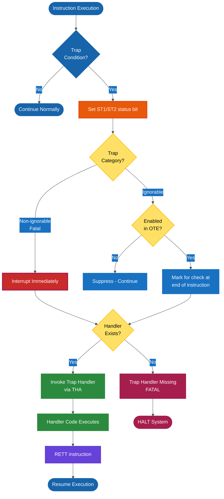
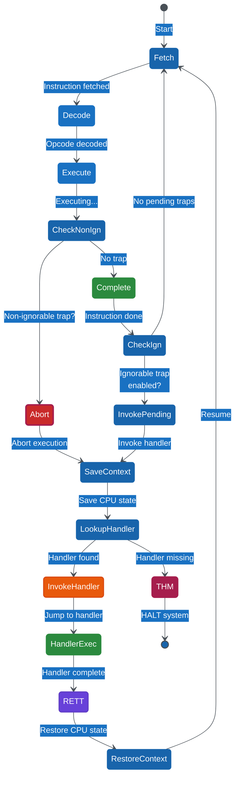
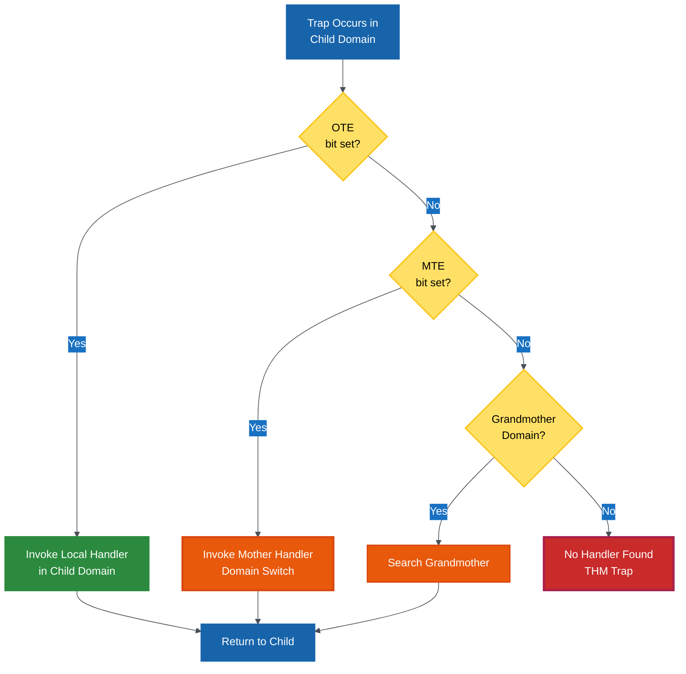

# ND-500 Trap System - Comprehensive Documentation

**Author:** Claude (based on ND-500 Reference Manual and source code analysis)
**Date:** 2025-11-06
**Status:** Complete Reference
**Applies to:** ND-500 CPU Architecture (1988)

---

## Table of Contents

1. [Overview](#overview)
2. [What is a Trap?](#what-is-a-trap)
3. [Trap Categories](#trap-categories)
4. [All 30+ Trap Types Explained](#all-trap-types-explained)
5. [Trap Registers](#trap-registers)
6. [How Trap Handlers Work](#how-trap-handlers-work)
7. [CPU Behavior During Traps](#cpu-behavior-during-traps)
8. [Instructions That Trigger Traps](#instructions-that-trigger-traps)
9. [What Happens When No Handler Exists](#what-happens-when-no-handler-exists)
10. [Trap Priorities and Interactions](#trap-priorities-and-interactions)
11. [Programming Examples](#programming-examples)
12. [Advanced Topics](#advanced-topics)

---

## Overview

The ND-500 trap system is a hardware-based exception handling mechanism that provides:
- **Error detection** (illegal instructions, divide by zero, page faults)
- **Debugging support** (breakpoints, single-step, branch/call tracing)
- **Memory protection** (access violations, stack overflow/underflow)
- **System integrity** (hardware faults, power failure detection)

Traps are similar to interrupts but are **synchronous** - they occur in direct response to instruction execution, not external events.

---

## What is a Trap?

A **trap** is an exceptional condition detected by the CPU that requires special handling:

1. **Trap condition occurs** (e.g., divide by zero)
2. **Status bit set** in ST1/ST2 registers
3. **Trap handler invoked** (if enabled and present)
4. **Handler processes trap** (fix error, log event, abort program)
5. **Execution resumes** or terminates



---

## Trap Categories

The ND-500 has **three categories** of traps based on how urgently they must be handled:

### 1. Fatal Traps (Bits 37-41)

**Always interrupt execution immediately. Cannot be disabled.**

| Bit | Name | Mnemonic | Description |
|-----|------|----------|-------------|
| 37 | Trap Handler Missing | THM | No handler exists for a trap that occurred |
| 38 | Page Fault | PGF | Virtual page not present in memory |
| 39 | Power Failure | PWF | Power supply voltage dropping |
| 40 | Processor Fault | PRF | CPU internal error detected |
| 41 | Hardware Fault | HF | Hardware malfunction detected |

**Characteristics:**
- ✗ Cannot be disabled
- ✗ Cannot be ignored
- ⚡ Immediate handler invocation
- 🛑 System typically halts if handler fails

### 2. Non-Ignorable Traps (Bits 32-36)

**Always interrupt execution. Cannot be masked by OTE.**

| Bit | Name | Mnemonic | Description |
|-----|------|----------|-------------|
| 32 | Index Scaling Error | XSE | Invalid index calculation |
| 33 | Illegal Instruction Code | IIC | Unknown/invalid opcode |
| 34 | Illegal Operand Specifier | IOS | Invalid addressing mode |
| 35 | Instruction Sequence Error | ISE | Wrong instruction order (e.g., CALL not followed by ENTR) |
| 36 | Protect Violation | PV | Access to protected memory |

**Characteristics:**
- ✗ Cannot be disabled by OTE
- ⚡ Instruction aborted immediately
- 🔄 Instruction NOT completed
- ⚠️ Must be handled or system halts

### 3. Ignorable Traps (Bits 11-29)

**Can be enabled/disabled. Checked at end of instruction.**

| Bit | Name | Mnemonic | Description |
|-----|------|----------|-------------|
| 11 | Invalid Operation | IVO | Illegal arithmetic operation |
| 12 | Divide by Zero | DZ | Division by zero attempted |
| 13 | Floating Underflow | FU | Float result too small to represent |
| 14 | Floating Overflow | FO | Float result too large to represent |
| 15 | BCD Overflow | BO | BCD arithmetic overflow |
| 16 | Illegal Operand Value | IOV | Operand value out of valid range |
| 17 | Single Instruction Trap | SIT | Single-step debugging |
| 18 | Branch Trap | BT | Branch instruction executed |
| 19 | Call Trap | CT | Call instruction executed |
| 20 | Breakpoint Trap | BPT | Breakpoint instruction executed |
| 21 | Address Trap Fetch | ATF | Instruction fetch from watched address |
| 22 | Address Trap Read | ATR | Data read from watched address |
| 23 | Address Trap Write | ATW | Data write to watched address |
| 24 | Address Zero Access | AZ | Access to address 0x0000 |
| 25 | Descriptor Range | DR | Descriptor index out of bounds |
| 26 | Illegal Index | IX | Index value invalid for operation |
| 27 | Stack Overflow | STO | TOS exceeded HL (high limit) |
| 28 | Stack Underflow | STU | TOS below LL (low limit) |
| 29 | Programmed Trap | PRT | Software-triggered trap (TRAP instruction) |

**Characteristics:**
- ✓ Can be enabled/disabled via OTE register
- ✓ Instruction completes normally
- 🕐 Handler invoked at end of instruction
- 🔕 Suppressed if OTE bit is 0

---

## All Trap Types Explained

### Fatal Traps

#### Trap 37: THM (Trap Handler Missing)

**When it occurs:**
- Another trap occurred
- CPU searched for handler at THA + (trap_number * 4)
- Handler address was 0x00000000 (NULL)

**What triggers it:**
```
Any enabled trap with no handler defined
```

**CPU behavior:**
- Sets ST2 bit 5 (bit 37)
- This is a **fatal double-fault** situation
- System typically enters panic/halt state

**Example scenario:**
```asm
; Divide by zero with DZ trap enabled
W1 := 10
W2 := 0
W3 := W1 / W2         ; DZ trap occurs

; CPU looks at THA + (12 * 4) for handler
; If THA[12] == 0x00000000:
;   → THM trap fires
;   → System halts
```

**Prevention:**
- Always set up trap handlers for enabled traps
- Initialize THA vector with valid addresses

---

#### Trap 38: PGF (Page Fault)

**When it occurs:**
- Virtual memory access
- Page table entry marked "not present"
- MMU cannot translate virtual → physical address

**What triggers it:**
```asm
; Any memory access to non-present page
W1 := 0x12345678       ; Load from virtual address
; If page containing 0x12345678 not in memory:
;   → PGF trap
```

**CPU behavior:**
1. Sets ST2 bit 6 (bit 38)
2. Saves faulting address in trap handler data field
3. Interrupts instruction immediately
4. Invokes page fault handler

**Handler responsibilities:**
- Load missing page from disk into memory
- Update page table entry
- Return to retry instruction

**If no handler:**
- THM trap → system halt

---

#### Trap 39: PWF (Power Failure)

**When it occurs:**
- Power supply voltage drops below threshold
- Battery backup engaged
- System has ~20ms to save state

**What triggers it:**
```
Hardware power monitor detects voltage drop
```

**CPU behavior:**
1. Sets ST2 bit 7 (bit 39)
2. Immediate interrupt (highest priority)
3. Invokes power fail handler
4. Handler must complete before power loss

**Handler responsibilities:**
- Save critical CPU state to non-volatile memory
- Mark system as "dirty" (requires recovery)
- Park disk heads
- Prepare for power loss

**Time constraints:**
- Must complete within milliseconds
- No complex operations allowed

---

#### Trap 40: PRF (Processor Fault)

**When it occurs:**
- CPU internal consistency check fails
- Parity error in registers
- Microcode detects illegal state

**What triggers it:**
```
Internal CPU error detection logic
```

**CPU behavior:**
- Sets ST2 bit 8 (bit 40)
- Immediate interrupt
- Processor state likely corrupted

**Handler options:**
- Attempt state recovery (risky)
- Log error and halt gracefully
- Reset processor

**Common causes:**
- Hardware malfunction
- Cosmic ray bit flip
- Overheating
- Manufacturing defect

---

#### Trap 41: HF (Hardware Fault)

**When it occurs:**
- External hardware error detected
- Memory parity error
- Bus error
- I/O device failure

**What triggers it:**
```
Hardware error signal from external devices
```

**CPU behavior:**
- Sets ST2 bit 9 (bit 41)
- Immediate interrupt
- System integrity compromised

**Handler responsibilities:**
- Identify failing component
- Attempt recovery if possible
- Log error for diagnostics
- Isolate faulty hardware

---

### Non-Ignorable Traps

#### Trap 32: XSE (Index Scaling Error)

**When it occurs:**
- Post-indexed addressing mode
- Index register contains invalid value
- Scaling calculation overflow

**What triggers it:**
```asm
; Post-indexed addressing: base + scale * index
W1 COPY ARRAY(I1)     ; I1 = 0x7FFFFFFF (huge)
; Calculation: ARRAY + 4*I1 overflows
;   → XSE trap
```

**CPU behavior:**
- Sets ST2 bit 0 (bit 32)
- Instruction aborted
- No memory access performed

**Prevention:**
- Validate index values
- Use bounds checking (CIND instruction)

---

#### Trap 33: IIC (Illegal Instruction Code)

**When it occurs:**
- Opcode not recognized by CPU
- Reserved opcode encountered
- Corrupted program memory

**What triggers it:**
```asm
.WORD 0xFFFF          ; Invalid opcode
; CPU attempts to execute:
;   → IIC trap
```

**Common causes:**
- Jumping to data
- Buffer overflow into code
- Uninitialized memory (0x0000)
- Hardware malfunction

**CPU behavior:**
- Sets ST2 bit 1 (bit 33)
- PC points to illegal instruction
- Instruction NOT executed

**Emulator behavior:**
```c
// From cpu.c line 70-72
if (opcode == 0x00 && trap_on_invalid_enabled) {
    trap_illegal_instruction(cpu, cpu->PC, 0x00);
    cpu->machine->run_flag = 0;  // Stop execution
}
```

---

#### Trap 34: IOS (Illegal Operand Specifier)

**When it occurs:**
- Invalid addressing mode for instruction
- Operand type mismatch
- Reserved address code used

**What triggers it:**
```asm
; Example: Using POST_INCREMENT on constant
W1 := #100(I1)+       ; Cannot post-increment a constant
;   → IOS trap
```

**CPU behavior:**
- Sets ST2 bit 2 (bit 34)
- Operand decoding failed
- Instruction aborted

**Common causes:**
- Invalid addressing mode combination
- Using reserved address codes (0xC8-0xCF special)
- Operand type incompatible with instruction

---

#### Trap 35: ISE (Instruction Sequence Error)

**When it occurs:**
- Required instruction sequence violated
- CALL not immediately followed by ENTR variant
- Return without matching call

**What triggers it:**
```asm
; WRONG - CALL must point to ENTR
CALLG SUBR, 0

SUBR:
    W1 + 1            ; NOT an entry point!
    RET
;   → ISE trap when CALLG executes
```

```asm
; WRONG - Domain call in progress
CALLG DOM_A, 0        ; Enter domain A
CALLG DOM_A, 0        ; Try to enter again before RET
;   → ISE trap (domain already active)
```

**CPU behavior:**
- Sets ST2 bit 3 (bit 35)
- Sequence violation detected
- Instruction aborted

**Prevented by:**
- CALL always points to ENTR instruction
- Domain calls properly nested
- Stack integrity maintained

---

#### Trap 36: PV (Protect Violation)

**When it occurs:**
- Write to read-only segment
- Access to privileged memory
- Violate segment permission bits

**What triggers it:**
```asm
; Write to read-only segment
W1 := 42
CONST_SEG := W1       ; CONST_SEG marked read-only
;   → PV trap
```

**Memory protection bits:**
- Bit 15: Write permission (0 = read-only)
- Bit 14: Parameter access (ALT prefix permission)
- Bit 13: Shared segment

**CPU behavior:**
- Sets ST2 bit 4 (bit 36)
- Faulting address saved
- Memory NOT modified

---

### Ignorable Traps

#### Trap 11: IVO (Invalid Operation)

**When it occurs:**
- Mathematically undefined operation
- Invalid combination of operands

**What triggers it:**
```asm
; Square root of negative number
F1 := -25.0
F2 := SQRT F1         ; √(-25) undefined
;   → IVO trap (if enabled)
```

**CPU behavior:**
- Instruction completes (may produce undefined result)
- Sets ST1 bit 11
- If OTE bit 11 set: handler invoked at end of instruction
- If OTE bit 11 clear: trap suppressed

---

#### Trap 12: DZ (Divide by Zero)

**When it occurs:**
- Integer or floating-point division by zero

**What triggers it:**
```asm
W1 := 100
W2 := 0
W3 := W1 / W2         ; Division by zero
;   → DZ trap (if enabled)
```

**Result handling:**
- Integer division: Result typically 0x7FFFFFFF (max int)
- Float division: Result typically +∞ or NaN

**CPU behavior:**
- Instruction completes with special result
- Sets ST1 bit 12
- Handler can examine result and decide action

**Common handler actions:**
- Log error and continue
- Substitute default value
- Abort program

---

#### Trap 13: FU (Floating Underflow)

**When it occurs:**
- Float result too small to represent (|x| < ~1.2e-38)
- Denormalized number would be needed

**What triggers it:**
```asm
F1 := 1.0e-30
F2 := 1.0e-30
F3 := F1 * F2         ; Result: 1.0e-60 (underflow)
;   → FU trap (if enabled)
```

**CPU behavior:**
- Result set to 0.0 (flush to zero)
- Sets ST1 bit 13
- Instruction completes

---

#### Trap 14: FO (Floating Overflow)

**When it occurs:**
- Float result too large to represent (|x| > ~3.4e+38)

**What triggers it:**
```asm
F1 := 1.0e30
F2 := 1.0e30
F3 := F1 * F2         ; Result: 1.0e60 (overflow)
;   → FO trap (if enabled)
```

**CPU behavior:**
- Result set to ±∞
- Sets ST1 bit 14
- Instruction completes

---

#### Trap 15: BO (BCD Overflow)

**When it occurs:**
- BCD arithmetic result exceeds valid BCD range
- Result digits > 9 after operation

**What triggers it:**
```asm
; BCD addition
W1 := 0x99999999      ; BCD: 99999999
W2 := 0x00000001      ; BCD: 00000001
W3 := W1 + W2         ; BCD result overflows
;   → BO trap (if enabled)
```

**BCD format:**
- Each nibble (4 bits) = one decimal digit (0-9)
- Valid range per nibble: 0x0-0x9
- Values 0xA-0xF are invalid

---

#### Trap 16: IOV (Illegal Operand Value)

**When it occurs:**
- Operand value outside acceptable range
- Array index out of bounds

**What triggers it:**
```asm
; Check index bounds: CIND
H1 CIND 15, 5, 10     ; Check if 5 ≤ 15 ≤ 10
;   → IOV trap (15 > 10, out of range)
```

**CIND instruction:**
```asm
<prefix> CIND <index>, <lower>, <upper>
; If index < lower OR index > upper:
;   → IOV trap
```

**Use cases:**
- Array bounds checking
- Enum value validation
- Range constraints

---

#### Trap 17: SIT (Single Instruction Trap)

**When it occurs:**
- After EVERY instruction (when enabled)

**What triggers it:**
```asm
; Enable single-step mode
OTE1 := OTE1 | (1 << 17)   ; Set bit 17

W1 := 42                    ; Executes
;   → SIT trap
; Handler returns
W2 := W1                    ; Executes
;   → SIT trap
; Handler returns
...
```

**CPU behavior:**
- Instruction completes normally
- Trap fires after completion
- Used for debugger single-stepping

**Implementation:**
- Debugger sets OTE bit 17
- Handler displays CPU state
- User presses key to continue
- Handler returns → next instruction executes

---

#### Trap 18: BT (Branch Trap)

**When it occurs:**
- Branch instruction executed (conditional or unconditional)

**What triggers it:**
```asm
; Enable branch tracing
OTE1 := OTE1 | (1 << 18)

IF = GO LABEL              ; Branch taken
;   → BT trap

IF != GO LABEL             ; Branch not taken
; No BT trap (branch instruction executed but not taken)
```

**Triggered by:**
- `IF <condition> GO <label>`
- `GO <label>`
- `JMAP` (computed goto)
- NOT triggered by: `CALL`, `RET` (those have separate CT trap)

**Use cases:**
- Code coverage analysis
- Branch profiling
- Control flow debugging

---

#### Trap 19: CT (Call Trap)

**When it occurs:**
- CALL/CALLG instruction executed

**What triggers it:**
```asm
; Enable call tracing
OTE1 := OTE1 | (1 << 19)

CALLG SUBR, 0              ; Call executed
;   → CT trap
```

**CPU behavior:**
- CALL completes (stack frame set up)
- CT trap fires before ENTR instruction
- Handler can inspect call arguments

**Use cases:**
- Call stack profiling
- Function entry logging
- Security monitoring (system call auditing)

---

#### Trap 20: BPT (Breakpoint Trap)

**When it occurs:**
- Explicit breakpoint instruction executed

**What triggers it:**
```asm
; Debugger inserts breakpoint
ORIGINAL:
    W1 := 42

PATCHED:
    BPAUSE                 ; Breakpoint instruction
    W1 := 42
;   → BPT trap when BPAUSE executes
```

**CPU behavior:**
- Instruction completes
- BPT trap fires
- Handler typically enters debugger

**Debugger technique:**
1. Save original instruction
2. Replace with BPAUSE
3. When BPT trap fires:
   - Display CPU state
   - Restore original instruction
   - User can inspect/modify state
   - Single-step or continue

---

#### Trap 21-23: ATF, ATR, ATW (Address Traps)

**When they occur:**
- Memory access to watched address

**What triggers them:**

```asm
; Set address watchpoint at 0x10000
; ATF: Instruction fetch from 0x10000
; ATR: Data read from 0x10000
; ATW: Data write to 0x10000

; Example: Watch variable
VAR: .WORD 100            ; At address 0x10000

; Debugger enables ATW for 0x10000

W1 := VAR                 ; Read: no trap (ATW watches writes)
VAR := 42                 ; Write: ATW trap fires
```

**CPU behavior:**
- Memory access completes
- Trap fires after completion
- Handler can inspect old/new values

**Use cases:**
- Data breakpoints (watch variables)
- Memory corruption detection
- Race condition debugging

**Implementation:**
- Hardware comparators match address
- Separate enable bits for fetch/read/write

---

#### Trap 24: AZ (Address Zero Access)

**When it occurs:**
- Any access to address 0x00000000

**What triggers it:**
```asm
; Null pointer dereference
W1 := 0
W2 := IND(W1)             ; Read from address 0x00000000
;   → AZ trap (if enabled)
```

**CPU behavior:**
- Access may complete (reading zero) or fault
- Sets ST1 bit 24
- Helps detect null pointer bugs

**Use cases:**
- Null pointer detection
- Uninitialized pointer detection
- Catch common programming errors

---

#### Trap 25: DR (Descriptor Range)

**When it occurs:**
- Descriptor addressing with index out of bounds
- Array access beyond declared size

**What triggers it:**
```asm
; Descriptor with 10 elements
DESC:
    .WORD 10              ; Length
    .WORD ARRAY           ; Base address

; Access element 15
W1 := DESC(15)            ; Index 15 >= length 10
;   → DR trap (if enabled)
```

**CPU behavior:**
- Bounds check before access
- If out of range: trap fires, no access
- If in range: access proceeds

---

#### Trap 26: IX (Illegal Index)

**When it occurs:**
- Index register value invalid for operation
- Negative index where not allowed
- Index exceeds maximum

**What triggers it:**
```asm
; Negative index
I1 := -5
W1 := ARRAY(I1)           ; Negative index
;   → IX trap (if enabled)
```

**CPU behavior:**
- Index validation before use
- Different from DR (which checks descriptor bounds)
- IX checks index register value itself

---

#### Trap 27: STO (Stack Overflow)

**When it occurs:**
- TOS register exceeds HL (High Limit)
- Stack growing upward past limit

**What triggers it:**
```asm
; Setup
HL := 0x100000            ; High limit
TOS := 0x0FFF00           ; Current top

; Push many values
PUSH W1                   ; TOS += 4
PUSH W2                   ; TOS += 4
PUSH W3                   ; TOS += 4
...
; When TOS > HL:
;   → STO trap
```

**CPU behavior:**
- Comparison after each stack operation
- Trap fires if TOS > HL
- Prevents stack collision with heap

**Handler options:**
- Allocate more stack space
- Compact/move stack
- Abort program

---

#### Trap 28: STU (Stack Underflow)

**When it occurs:**
- TOS register below LL (Low Limit)
- Popping from empty stack

**What triggers it:**
```asm
; Setup
LL := 0x0F0000            ; Low limit
TOS := 0x0F0004           ; Near bottom

; Pop too many values
POP W1                    ; TOS -= 4 → 0x0F0000
POP W2                    ; TOS -= 4 → 0x0EF FFC
;   → STU trap (TOS < LL)
```

**CPU behavior:**
- Comparison after each stack operation
- Trap fires if TOS < LL
- Prevents underflow corruption

---

#### Trap 29: PRT (Programmed Trap)

**When it occurs:**
- Explicit TRAP instruction executed
- Software-triggered trap

**What triggers it:**
```asm
; Explicit trap
TRAP                      ; Software interrupt
;   → PRT trap
```

**CPU behavior:**
- Like software interrupt
- Handler can implement system calls
- Returns normally with RETT

**Use cases:**
- System call interface
- Assertions (`TRAP` = abort)
- Cooperative multitasking (yield)

---

## Trap Registers

### Status Registers (ST1/ST2)

**64-bit combined register showing trap status:**

```
ST2 (bits 32-63)          ST1 (bits 0-31)
+------------------+      +------------------+
|   Fatal/Non-Ign  |      |    Ignorable     |
+------------------+      +------------------+
   Bits 32-41               Bits 11-29
```

**Properties:**
- Bit set to 1 when trap occurs
- Handler reads to determine trap cause
- Handler clears bit after processing
- Non-ignorable bits auto-clear when handler invoked

**Reading status:**
```asm
; Check if divide by zero occurred
W1 := ST1
W1 & (1 << 12)            ; Test bit 12 (DZ)
IF = GO DZ_HANDLER
```

---

### Trap Enable Registers

#### OTE1/OTE2 (Own Trap Enable)

**Control which traps are enabled in current domain:**

```asm
; Enable divide by zero trap
W1 := OTE1
W1 := W1 | (1 << 12)      ; Set bit 12
OTE1 := W1

; Disable floating overflow
W1 := OTE1
W1 := W1 & ~(1 << 14)     ; Clear bit 14
OTE1 := W1
```

**Properties:**
- Bits 11-29: Enable/disable ignorable traps
- 1 = enabled (handler will be invoked)
- 0 = disabled (trap suppressed)
- Bits 32-41: Ignored (non-ignorable traps always enabled)
- ENTT instruction clears OTE (prevents recursive traps)
- RETT instruction restores OTE from saved value

---

#### MTE1/MTE2 (Mother Trap Enable)

**Indicates mother domain has handler:**

```
Read-only register set by system.
Bit set if any parent domain has CTE bit set.
```

**Trap search order:**
1. Check OTE: Local handler?
2. Check MTE: Mother handler?
3. If neither: Search up domain tree
4. If none found: THM trap

---

#### CTE1/CTE2 (Child Trap Enable)

**Indicates this domain handles child domain traps:**

```asm
; Set bit to handle child divide-by-zero
W1 := CTE1
W1 := W1 | (1 << 12)
CTE1 := W1
```

**Effect:**
- Child domain's MTE bit 12 will be set
- If child DZ trap with no local handler:
  - Mother domain handler invoked
  - Domain switch occurs

---

#### TEMM1/TEMM2 (Trap Enable Modification Mask)

**Controls which OTE bits can be modified:**

```
Read-only register set by system.
Bit set = corresponding OTE bit can be modified.
Bit clear = OTE bit is locked.
```

**Use case:**
- Security: Prevent disabling critical traps
- Example: Force breakpoint traps enabled for debugging

---

### THA (Trap Handler Address Register)

**Points to trap handler vector table:**

```
THA = base address of 64-word array

Memory layout:
+------------------+
| THA →            |
+------------------+
| [0]: Handler for trap 0  (4 bytes)  |
| [1]: Handler for trap 1  (4 bytes)  |
| [2]: Handler for trap 2  (4 bytes)  |
| ...                                  |
| [11]: Handler for trap 11 (IVO)     |
| [12]: Handler for trap 12 (DZ)      |
| ...                                  |
| [63]: Handler for trap 63           |
+------------------+
| Trap handler data field (20+ bytes) |
+------------------+
```

**Handler address calculation:**
```
handler_address = memory[THA + (trap_number * 4)]
```

**Setup:**
```asm
; Initialize trap vector table
THA := TRAP_TABLE

TRAP_TABLE:
    .WORD 0                ; Trap 0: (unused)
    .WORD 0                ; Trap 1: (unused)
    ...
    .WORD 0                ; Trap 11: (unused)
    .WORD DZ_HANDLER       ; Trap 12: Divide by zero
    .WORD FU_HANDLER       ; Trap 13: Float underflow
    .WORD FO_HANDLER       ; Trap 14: Float overflow
    ...

DZ_HANDLER:
    ENTT 100, 0
    ; Handle divide by zero
    RETT
```

---

## How Trap Handlers Work

### Handler Invocation Process

```mermaid
%%{init: {'theme':'base', 'themeVariables': { 'primaryColor':'#1864ab', 'primaryTextColor':'#fff', 'primaryBorderColor':'#1864ab', 'lineColor':'#495057', 'secondaryColor':'#1971c2', 'tertiaryColor':'#2b8a3e', 'tertiaryTextColor':'#fff'}}}%%
sequenceDiagram
    participant Instr as Instruction
    participant CPU as CPU
    participant ST as ST1/ST2
    participant OTE as OTE1/OTE2
    participant THA as THA Vector
    participant Handler as Trap Handler
    participant Memory as Memory/Stack

    Instr->>CPU: Trap condition detected
    CPU->>ST: Set status bit

    alt Non-Ignorable/Fatal
        CPU->>CPU: Interrupt immediately
    else Ignorable
        CPU->>Instr: Complete instruction
        CPU->>OTE: Check if enabled
        alt Disabled
            CPU->>CPU: Suppress trap
        end
    end

    CPU->>THA: Read handler address<br/>[THA + trap_num * 4]
    THA-->>CPU: Handler address

    alt Handler exists (addr != 0)
        CPU->>Memory: Save context to<br/>trap handler data field
        Note over Memory: PREVB, RETA, SP, AUX, N,<br/>Registers, Trapping PC
        CPU->>OTE: Clear OTE (prevent recursion)
        CPU->>Handler: Jump to handler
        Handler->>Handler: ENTT instruction<br/>Initialize trap frame
        Handler->>Handler: Process trap
        Handler->>Handler: RETT instruction
        Handler->>CPU: Restore OTE, context
        CPU->>ST: Clear status bit
        CPU->>Instr: Resume execution
    else Handler missing (addr == 0)
        CPU->>CPU: THM trap (fatal)
        CPU->>CPU: HALT
    end

    style CPU fill:#1864ab,stroke:#1864ab,stroke-width:3px,color:#fff
    style ST fill:#e8590c,stroke:#d9480f,stroke-width:2px,color:#fff
    style OTE fill:#1971c2,stroke:#1971c2,stroke-width:2px,color:#fff
    style THA fill:#6741d9,stroke:#5f3dc4,stroke-width:2px,color:#fff
    style Handler fill:#2b8a3e,stroke:#2b8a3e,stroke-width:3px,color:#fff
    style Memory fill:#ffe066,stroke:#fcc419,stroke-width:2px,color:#000
```

---

### Trap Handler Data Field

**Automatically filled by CPU when handler invoked:**

```
THA + 256 bytes (after 64-word vector)
+------------------+
| B.PREVB (4 bytes) | Previous B register
| B.RETA  (4 bytes) | Return address
| B.SP    (4 bytes) | Stack pointer
| B.AUX   (4 bytes) | Auxiliary
| B.N     (4 bytes) | Number of arguments (always 0 for traps)
+------------------+
| Trapping PC       | PC where trap occurred
| Register block    | All CPU registers saved
| Trap information  | Trap number, status, etc.
+------------------+
```

**Handler accesses saved state:**
```asm
TRAP_HANDLER:
    ENTT 100, 0               ; Enter trap handler

    ; Access saved PC
    W1 := B.TRAP_PC           ; Get where trap occurred

    ; Access saved registers
    W2 := B.SAVED_I1
    W3 := B.SAVED_A1

    ; Fix problem / log error / etc.

    RETT                      ; Return from trap
```

---

### ENTT Instruction (Enter Trap Handler)

**Format:**
```asm
ENTT <stack_demand>, <max_args>
```

**What it does:**
1. Allocates stack space (<stack_demand> bytes)
2. Initializes trap handler stack frame
3. Sets B register to trap handler data field
4. OTE already cleared by CPU (prevents recursive traps)

**Example:**
```asm
DZ_HANDLER:
    ENTT 100, 0               ; 100 bytes stack, no args

    ; Handler code here
    W1 := B.TRAP_PC           ; Where did trap occur?

    RETT
```

---

### RETT Instruction (Return from Trap Handler)

**Format:**
```asm
RETT
```

**What it does:**
1. Restores OTE from saved value (re-enables traps)
2. Restores CPU registers from trap handler data field
3. Clears ST1/ST2 bit for this trap
4. Returns to saved PC (either retry or continue)

**Return behavior:**
- **Non-ignorable traps**: PC points to faulting instruction (retry)
- **Ignorable traps**: PC points to next instruction (continue)

---

## CPU Behavior During Traps

### Instruction Execution States



---

### Context Saved by CPU

**Registers saved to trap handler data field:**
- PC (Program Counter) - where trap occurred
- FLAGS - condition codes
- I1-I4 (Integer registers)
- A1-A4 (Address registers)
- E1-E4 (Extended precision registers)
- F1-F4 (Floating-point registers)
- L, B, R (Level, Base, Return)
- TOS, LL, HL (Stack registers)
- OTE1, OTE2 (Trap enables - for restoration)
- ST1, ST2 (Status - trap bits)

**NOT automatically saved:**
- MMU registers (PSTP, DITBASE, CED, CAD, PS)
- Other special registers

**Handler can save additional state if needed:**
```asm
TRAP_HANDLER:
    ENTT 200, 0

    ; Save MMU state
    W1 := PSTP
    B.SAVED_PSTP := W1

    ; ... process trap ...

    ; Restore MMU state
    W1 := B.SAVED_PSTP
    PSTP := W1

    RETT
```

---

## Instructions That Trigger Traps

### Comprehensive Mapping

| Trap | Instructions That Can Trigger It |
|------|----------------------------------|
| **XSE** | Any instruction with post-indexed addressing: `ARRAY(I1)`, `DESC(I2)` |
| **IIC** | Attempting to execute invalid opcode (0xFFFF, 0x0000 if trapped, reserved opcodes) |
| **IOS** | Any instruction with invalid addressing mode combination |
| **ISE** | `CALL`/`CALLG` not pointing to `ENTR*`, `RET` without matching call, double domain call |
| **PV** | Any memory write to read-only segment, privileged instruction in user mode |
| **THM** | (Secondary trap when primary trap has no handler) |
| **PGF** | Any memory access to non-present virtual page |
| **PWF** | (Hardware signal - no specific instruction) |
| **PRF** | (Hardware signal - CPU internal error) |
| **HF** | (Hardware signal - external hardware error) |
| **IVO** | `SQRT` negative, invalid math operation |
| **DZ** | `/` (divide), `MOD` (modulo), `DIVL` (long divide) with zero divisor |
| **FU** | `F*` (float multiply), `F/` (float divide) producing underflow |
| **FO** | `F+`, `F*`, `F**` (float power) producing overflow |
| **BO** | BCD arithmetic: `+`, `-`, `*`, `/` on BCD-formatted operands |
| **IOV** | `CIND` (check index) with out-of-range index |
| **SIT** | Every instruction (when enabled) |
| **BT** | `IF <cond> GO`, `GO`, `JMAP` |
| **CT** | `CALL`, `CALLG`, `CALLS` |
| **BPT** | `BPAUSE` (breakpoint instruction) |
| **ATF** | Any instruction fetch from watched address |
| **ATR** | Any load/read from watched address |
| **ATW** | Any store/write to watched address |
| **AZ** | Any access to address 0x00000000 |
| **DR** | Descriptor addressing beyond descriptor bounds |
| **IX** | Array indexing with invalid index value |
| **STO** | `PUSH`, stack allocation in `ENTS`/`ENTSN`/`ENTB`, any instruction growing stack |
| **STU** | `POP`, `RET`, any instruction shrinking stack |
| **PRT** | `TRAP` instruction (explicit software trap) |

---

### Arithmetic Instructions

```asm
; Division can trigger DZ
W1 := 100
W2 := 0
W3 := W1 / W2             ; → DZ trap

; Modulo can trigger DZ
W4 := W1 MOD W2           ; → DZ trap

; Floating-point can trigger FO, FU, IVO
F1 := 1.0e30
F2 := 1.0e30
F3 := F1 * F2             ; → FO trap (overflow)

F1 := 1.0e-30
F2 := 1.0e-30
F3 := F1 * F2             ; → FU trap (underflow)

F1 := -25.0
F2 := SQRT F1             ; → IVO trap (invalid)
```

---

### Memory Access Instructions

```asm
; Any load can trigger PGF, PV, ATR, AZ
W1 := MEMORY_LOCATION     ; → PGF if page not present
                          ; → PV if no read permission
                          ; → ATR if watched address
                          ; → AZ if address == 0

; Any store can trigger PGF, PV, ATW, AZ
MEMORY_LOCATION := W1     ; → PGF if page not present
                          ; → PV if read-only segment
                          ; → ATW if watched address
                          ; → AZ if address == 0
```

---

### Control Flow Instructions

```asm
; Branch triggers BT
IF = GO LABEL             ; → BT trap

; Call triggers CT, possibly ISE
CALLG SUBR, 0             ; → CT trap
                          ; → ISE if SUBR not ENTR*

; Invalid jump triggers IIC
GO 0x0000                 ; → IIC if 0x0000 is invalid opcode
```

---

### Stack Instructions

```asm
; Push can trigger STO
PUSH W1                   ; TOS increases
                          ; → STO if TOS > HL

; Pop can trigger STU
POP W1                    ; TOS decreases
                          ; → STU if TOS < LL
```

---

### Indexing Instructions

```asm
; Post-indexed can trigger XSE
W1 := ARRAY(I1)           ; → XSE if I1 * scale overflows

; Bounds checking triggers IOV
CIND I1, 0, 100           ; → IOV if I1 < 0 or I1 > 100

; Descriptor can trigger DR
W1 := DESC(10)            ; → DR if 10 >= DESC.length

; Index can trigger IX
I1 := -5
W1 := ARRAY(I1)           ; → IX if negative not allowed
```

---

## What Happens When No Handler Exists

### The THM Cascade

```mermaid
%%{init: {'theme':'base', 'themeVariables': { 'primaryColor':'#1864ab', 'primaryTextColor':'#fff', 'primaryBorderColor':'#1864ab', 'lineColor':'#495057', 'secondaryColor':'#1971c2', 'tertiaryColor':'#2b8a3e', 'tertiaryTextColor':'#fff'}}}%%
flowchart TD
    Trap1[Primary Trap Occurs<br/>e.g., DZ - Divide by Zero] --> Check1{Handler<br/>Exists?}

    Check1 -->|Yes| Invoke1[Invoke DZ Handler]
    Check1 -->|No THA[12]==0| THM[THM Trap Raised<br/>Trap 37]

    Invoke1 --> Success[Handler Completes<br/>RETT]

    THM --> Check2{THM Handler<br/>Exists?}
    Check2 -->|Yes| Invoke2[Invoke THM Handler]
    Check2 -->|No THA[37]==0| Fatal[FATAL:<br/>No THM Handler]

    Invoke2 --> Log[Log Error<br/>Attempt Recovery]
    Log --> Recover{Can<br/>Recover?}

    Recover -->|Yes| Fix[Fix Problem<br/>Set Up Handler]
    Recover -->|No| Halt

    Fix --> Success

    Fatal --> Halt[HALT System<br/>Enter Debug/Panic]

    Success --> Resume[Resume Execution]

    style Trap1 fill:#1864ab,stroke:#1864ab,stroke-width:3px,color:#fff
    style THM fill:#e8590c,stroke:#d9480f,stroke-width:3px,color:#fff
    style Fatal fill:#c92a2a,stroke:#a61e4d,stroke-width:4px,color:#fff
    style Halt fill:#a61e4d,stroke:#a61e4d,stroke-width:3px,color:#fff
    style Success fill:#2b8a3e,stroke:#2b8a3e,stroke-width:3px,color:#fff
    style Resume fill:#1864ab,stroke:#1864ab,stroke-width:2px,color:#fff
    style Check1 fill:#ffe066,stroke:#fcc419,stroke-width:2px,color:#000
    style Check2 fill:#ffe066,stroke:#fcc419,stroke-width:2px,color:#000
    style Recover fill:#ffe066,stroke:#fcc419,stroke-width:2px,color:#000
```

---

### Scenario 1: Missing Handler for Enabled Trap

```asm
; Enable divide by zero trap
OTE1 := OTE1 | (1 << 12)

; But THA vector not initialized
THA := TRAP_TABLE
TRAP_TABLE:
    ...
    .WORD 0              ; Trap 12: No handler!
    ...

; Now divide by zero
W1 := 100 / 0            ; → DZ trap
                         ; → CPU looks at THA[12]
                         ; → Finds 0x00000000
                         ; → THM trap fires!
```

**Result:**
- THM trap (37) raised
- If THM handler exists: invoked
- If no THM handler: system halts

---

### Scenario 2: Handler Causes Another Trap

```asm
DZ_HANDLER:
    ENTT 100, 0

    ; BUG: Handler itself divides by zero!
    W1 := 100
    W2 := 0
    W3 := W1 / W2        ; → DZ trap AGAIN

    ; But OTE was cleared by CPU when entering handler
    ; So this DZ trap won't recursively call handler
    ; Instead: propagates to mother domain or causes ISE

    RETT
```

**Result:**
- OTE cleared on handler entry (prevents recursion)
- Second trap either:
  - Propagates to mother domain (if MTE set)
  - Causes ISE trap (instruction sequence error)
  - System becomes unstable

---

### Scenario 3: Fatal Trap with No Handler

```asm
; Page fault with no handler
; System attempts to access non-present page
W1 := 0x12345678        ; → PGF trap
                        ; → THA[38] == 0
                        ; → THM trap
                        ; → THA[37] == 0
                        ; → HALT
```

**Result:**
- Immediate system halt
- CPU enters error state
- Debugger/panic handler invoked (if available)
- Typically requires reset

---

### Best Practices

**1. Always Set Up Critical Handlers:**
```asm
; Minimum trap handler setup
TRAP_TABLE:
    .REPT 64
        .WORD DEFAULT_HANDLER
    .ENDR

; Override specific traps
TRAP_TABLE + (12 * 4) := DZ_HANDLER
TRAP_TABLE + (38 * 4) := PGF_HANDLER

DEFAULT_HANDLER:
    ENTT 50, 0
    ; Log unexpected trap
    ; Halt or abort program
    RETT
```

**2. Set Up THM Handler:**
```asm
TRAP_TABLE + (37 * 4) := THM_HANDLER

THM_HANDLER:
    ENTT 100, 0

    ; Determine which trap had no handler
    W1 := B.TRAP_INFO

    ; Log error
    CALL LOG_ERROR

    ; Attempt to set up handler dynamically
    ; Or gracefully shut down

    RETT
```

**3. Disable Unneeded Traps:**
```asm
; If no handler, disable trap
OTE1 := 0                ; Disable all ignorable traps
OTE2 := 0

; Only enable traps with handlers
OTE1 := (1 << 12)        ; Enable DZ only
```

---

## Trap Priorities and Interactions

### Priority Hierarchy

**When multiple traps occur simultaneously:**

```
Highest Priority (checked first)
  ↓
1. Hardware Faults (PWF, PRF, HF)
2. Fatal Traps (THM, PGF)
3. Non-Ignorable (XSE, IIC, IOS, ISE, PV)
4. Ignorable (bits 11-29, highest bit number first)
  ↓
Lowest Priority (checked last)
```

**Example:**
```asm
; Instruction causes multiple traps
W1 := MEMORY(I1) / W2

; Possible traps:
; - XSE (I1 causes index scaling error)
; - PGF (MEMORY page not present)
; - DZ (W2 is zero)

; Processing order:
; 1. PGF checked first (fatal trap)
; 2. If no PGF, XSE checked (non-ignorable)
; 3. If no XSE, instruction completes
; 4. Then DZ checked (ignorable, at end of instruction)
```

---

### Simultaneous Ignorable Traps

**Multiple ignorable traps in one instruction:**

```asm
; Floating-point operation
F1 := 1.0e30
F2 := 1.0e-30
F3 := (F1 * F1) / F2     ; Can cause:
                         ; - FO (overflow in F1*F1)
                         ; - FU (underflow in /F2)
```

**Resolution:**
1. All applicable trap bits set in ST1
2. At end of instruction, check pending traps
3. Handle **highest priority** (highest bit number) first
4. Handler clears that bit
5. Next instruction: check again for remaining traps

**Priority order (ignorable):**
```
Bit 29 (PRT) - highest priority
Bit 28 (STU)
Bit 27 (STO)
...
Bit 12 (DZ)
Bit 11 (IVO) - lowest priority
```

---

### Trap During Trap Handler

**OTE cleared on entry prevents recursion:**

```asm
DZ_HANDLER:
    ENTT 100, 0
    ; OTE now = 0 (cleared by CPU)

    W1 := 100 / 0        ; DZ condition occurs
                         ; But OTE bit 12 = 0
                         ; → Trap suppressed
                         ; OR propagates to mother domain

    RETT
    ; OTE restored to original value
```

**If trap MUST be handled in handler:**
```asm
DZ_HANDLER:
    ENTT 100, 0

    ; Re-enable only specific trap
    W1 := OTE1
    W1 := W1 | (1 << 20)  ; Enable BPT only
    OTE1 := W1

    ; Now BPT trap can fire, but not DZ

    RETT
```

---

### Domain Traversal

**Trap handler search across domains:**



**Search algorithm:**
1. Check OTE in current domain
2. If OTE bit set: use local handler
3. If OTE bit clear: check MTE
4. If MTE bit set: traverse to mother domain
5. Repeat in mother domain
6. If reach root with no handler: THM trap

---

## Programming Examples

### Example 1: Basic Divide-by-Zero Handler

```asm
; ================================================
; Setup trap vector and enable DZ trap
; ================================================
INIT:
    ; Initialize THA
    THA := TRAP_VECTOR

    ; Enable divide-by-zero trap
    W1 := OTE1
    W1 := W1 | (1 << 12)      ; Set bit 12 (DZ)
    OTE1 := W1

    ; Continue with main program
    GO MAIN

; ================================================
; Trap vector table
; ================================================
TRAP_VECTOR:
    .REPT 12                  ; Traps 0-11
        .WORD 0
    .ENDR
    .WORD DZ_HANDLER          ; Trap 12: Divide by zero
    .REPT 51                  ; Traps 13-63
        .WORD 0
    .ENDR

; ================================================
; Divide-by-zero trap handler
; ================================================
DZ_HANDLER:
    ENTT 100, 0               ; Enter trap handler

    ; Get where trap occurred
    W1 := B.TRAP_PC

    ; Log error
    CALL LOG_ERROR

    ; Get saved result register
    W2 := B.SAVED_W3
    W2 := 0                   ; Set result to 0
    B.SAVED_W3 := W2          ; Update saved value

    ; Return (execution continues)
    RETT

; ================================================
; Main program
; ================================================
MAIN:
    W1 := 100
    W2 := 0
    W3 := W1 / W2             ; → DZ trap
                              ; → DZ_HANDLER invoked
                              ; → W3 set to 0
                              ; → Execution continues here

    ; W3 now contains 0

    GO DONE
```

---

### Example 2: Page Fault Handler (Demand Paging)

```asm
; ================================================
; Page fault handler - load page from disk
; ================================================
PGF_HANDLER:
    ENTT 200, 0               ; Need more stack for I/O

    ; Get faulting virtual address
    W1 := B.FAULT_ADDR

    ; Calculate page number
    W2 := W1 >> 12            ; Divide by 4096 (page size)

    ; Check if valid page
    W3 := MAX_PAGES
    W2 COMP W3
    IF >= GO PAGE_INVALID

    ; Find free physical frame
    CALL FIND_FREE_FRAME
    ; Returns frame number in W1

    W4 := W1                  ; Save frame number

    ; Load page from disk
    W1 := W2                  ; Page number
    W2 := W4                  ; Frame number
    CALL LOAD_PAGE_FROM_DISK

    ; Update page table entry
    W1 := W2                  ; Page number
    W2 := W4                  ; Frame number
    W2 := W2 | 0x0001         ; Set "present" bit
    CALL UPDATE_PAGE_TABLE

    ; Instruction will be retried
    RETT

PAGE_INVALID:
    ; Invalid page access - terminate program
    CALL ABORT_PROGRAM
    RETT
```

---

### Example 3: Debugger with Breakpoints

```asm
; ================================================
; Debugger: Set breakpoint at address
; ================================================
SET_BREAKPOINT:
    ; Input: W1 = address to set breakpoint

    ; Save original instruction
    W2 := IND(W1)
    CALL SAVE_ORIGINAL_INSTR

    ; Replace with BPAUSE instruction
    W2 := BPAUSE_OPCODE
    IND(W1) := W2

    RET

; ================================================
; Breakpoint trap handler
; ================================================
BPT_HANDLER:
    ENTT 150, 0

    ; Get breakpoint address
    W1 := B.TRAP_PC

    ; Restore original instruction
    CALL GET_ORIGINAL_INSTR
    ; Returns original in W2
    IND(W1) := W2

    ; Display CPU state
    CALL DISPLAY_REGISTERS
    CALL DISPLAY_STACK
    CALL DISPLAY_MEMORY

    ; Enter debugger command loop
    CALL DEBUGGER_PROMPT

    ; User can:
    ; - Single-step (enable SIT trap)
    ; - Continue (clear breakpoint or re-set)
    ; - Modify registers/memory

    RETT

; ================================================
; Single-step handler
; ================================================
SIT_HANDLER:
    ENTT 100, 0

    ; Display current instruction
    W1 := B.TRAP_PC
    CALL DISASSEMBLE_AT

    ; Display registers
    CALL DISPLAY_REGISTERS

    ; Wait for user
    CALL WAIT_USER_INPUT

    ; User pressed key - continue
    RETT
```

---

### Example 4: Stack Overflow Handler with Dynamic Growth

```asm
; ================================================
; Stack overflow handler - grow stack
; ================================================
STO_HANDLER:
    ENTT 200, 0

    ; Check if stack can grow
    W1 := HL                  ; Current high limit
    W2 := HEAP_START
    W1 COMP W2
    IF >= GO STACK_EXHAUSTED  ; Stack hit heap

    ; Allocate more stack space (e.g., 64KB)
    W1 := HL
    W2 := 65536
    W1 := W1 + W2             ; New high limit

    ; Update HL register in saved context
    B.SAVED_HL := W1

    ; Success - return and retry
    RETT

STACK_EXHAUSTED:
    ; Cannot grow stack further
    CALL DISPLAY_ERROR
    CALL ABORT_PROGRAM
    RETT
```

---

### Example 5: Comprehensive Trap Setup

```asm
; ================================================
; Initialize complete trap system
; ================================================
INIT_TRAPS:
    ; Set up THA vector
    THA := TRAP_VECTOR

    ; Initialize all traps to default handler
    W1 := TRAP_VECTOR
    W2 := 0
INIT_LOOP:
    W3 := DEFAULT_TRAP_HANDLER
    IND(W1) := W3
    W1 := W1 + 4
    W2 := W2 + 1
    W2 COMP 64
    IF < GO INIT_LOOP

    ; Override specific traps
    TRAP_VECTOR + (12 * 4) := DZ_HANDLER
    TRAP_VECTOR + (20 * 4) := BPT_HANDLER
    TRAP_VECTOR + (27 * 4) := STO_HANDLER
    TRAP_VECTOR + (28 * 4) := STU_HANDLER
    TRAP_VECTOR + (37 * 4) := THM_HANDLER
    TRAP_VECTOR + (38 * 4) := PGF_HANDLER

    ; Enable ignorable traps
    W1 := 0
    W1 := W1 | (1 << 12)      ; DZ
    W1 := W1 | (1 << 20)      ; BPT
    W1 := W1 | (1 << 27)      ; STO
    W1 := W1 | (1 << 28)      ; STU
    OTE1 := W1

    ; Set stack limits
    LL := STACK_BOTTOM
    HL := STACK_TOP
    TOS := STACK_BOTTOM + 100

    RET

; ================================================
; Default trap handler (unexpected traps)
; ================================================
DEFAULT_TRAP_HANDLER:
    ENTT 100, 0

    ; Determine trap number
    W1 := B.TRAP_NUMBER

    ; Display error
    CALL PRINT_STRING
    .ASCII "Unexpected trap: "
    CALL PRINT_HEX

    ; Display where it occurred
    W1 := B.TRAP_PC
    CALL PRINT_STRING
    .ASCII " at PC: "
    CALL PRINT_HEX

    ; Halt program
    CALL ABORT_PROGRAM

    RETT
```

---

## Advanced Topics

### Trap Handler Missing (THM) Recovery

**Sophisticated THM handler can dynamically install handlers:**

```asm
THM_HANDLER:
    ENTT 200, 0

    ; Determine which trap had no handler
    W1 := B.ORIGINAL_TRAP_NUM

    ; Check if we have a dynamic handler
    CALL LOOKUP_DYNAMIC_HANDLER
    ; Returns handler address in W2

    W2 COMP 0
    IF = GO NO_DYNAMIC

    ; Install handler dynamically
    W1 := THA
    W3 := B.ORIGINAL_TRAP_NUM
    W3 := W3 * 4
    W1 := W1 + W3
    IND(W1) := W2            ; Install handler

    ; Retry original trap
    ; (Set flag to re-invoke original trap)

    RETT

NO_DYNAMIC:
    ; No handler available - abort
    CALL LOG_FATAL_ERROR
    CALL HALT_SYSTEM
    RETT
```

---

### Cross-Domain Trap Handling

**Mother domain handles child traps:**

```asm
; ================================================
; Setup: Mother domain handles child DZ traps
; ================================================
MOTHER_INIT:
    ; Set CTE to handle child divide by zero
    W1 := CTE1
    W1 := W1 | (1 << 12)
    CTE1 := W1

    ; Set up handler
    TRAP_VECTOR + (12 * 4) := MOTHER_DZ_HANDLER

; ================================================
; Mother domain DZ handler
; ================================================
MOTHER_DZ_HANDLER:
    ENTT 150, 0
    ; Now in mother domain (domain switch occurred)

    ; CAD contains child domain number
    W1 := CAD
    CALL LOG_CHILD_ERROR

    ; Access child domain info
    CALL GET_CHILD_INFO

    ; Fix problem or terminate child
    CALL FIX_CHILD_PROBLEM

    ; Return to child domain
    RETT
    ; Domain switch back to child occurs
```

---

### Nested Traps (Multiple Levels)

```
Instruction
  → DZ trap
    → DZ Handler
      → (OTE cleared)
      → BPT trap (if BPT enabled before DZ)
        → BPT Handler
          → (OTE cleared again)
          → Returns
        → Back in DZ Handler
        → Returns
      → Back to instruction
```

**Code:**
```asm
MAIN:
    W1 := 100 / 0             ; → DZ trap

DZ_HANDLER:
    ENTT 100, 0
    ; OTE saved and cleared

    ; Set breakpoint for debugging
    BPAUSE                    ; → BPT trap
                              ; (BPT still enabled in saved OTE)

BPT_HANDLER:
    ENTT 100, 0
    ; Another level of OTE save/clear

    CALL DISPLAY_STATE

    RETT                      ; Return to DZ_HANDLER

; Back in DZ_HANDLER:
    CALL FIX_DIVIDE_BY_ZERO

    RETT                      ; Return to MAIN
```

---

### Trap-Based System Calls

**Use PRT trap for system call interface:**

```asm
; ================================================
; User program calls OS via TRAP instruction
; ================================================
USER_PROGRAM:
    ; System call: open file
    W1 := SYSCALL_OPEN
    W2 := FILENAME
    TRAP                      ; → PRT trap

    ; W1 now contains file descriptor

; ================================================
; OS system call handler
; ================================================
PRT_HANDLER:
    ENTT 200, 0

    ; Get syscall number
    W1 := B.SAVED_W1

    ; Dispatch to appropriate handler
    W1 COMP SYSCALL_OPEN
    IF = GO SYSCALL_OPEN_HANDLER

    W1 COMP SYSCALL_READ
    IF = GO SYSCALL_READ_HANDLER

    ; ... more syscalls ...

    ; Return to user program
    RETT

SYSCALL_OPEN_HANDLER:
    ; Perform file open
    W2 := B.SAVED_W2          ; Get filename
    CALL OS_OPEN_FILE
    ; Result in W1

    ; Store result in saved context
    B.SAVED_W1 := W1

    GO PRT_RETURN
```

---

## Summary

The ND-500 trap system provides:

✅ **30+ trap types** covering errors, debugging, and system events
✅ **Three-tier priority system** (fatal, non-ignorable, ignorable)
✅ **Flexible enable/disable** via OTE register
✅ **Hardware context save** automatic on handler invocation
✅ **Domain-aware** trap propagation to parent domains
✅ **Sophisticated recovery** mechanisms for all trap types

**Key Principles:**
1. **Non-ignorable/fatal traps** interrupt immediately
2. **Ignorable traps** complete instruction first
3. **OTE controls** which traps invoke handlers
4. **THA register** points to handler vector
5. **ENTT enters**, **RETT returns** from handlers
6. **THM trap** if handler missing

**Best Practices:**
- Always set up THM handler (trap 37)
- Initialize THA before enabling traps
- Only enable traps with handlers installed
- Save/restore additional CPU state if needed
- Test trap handlers thoroughly
- Handle recursive trap scenarios

---

**End of ND-500 Trap System Documentation**
