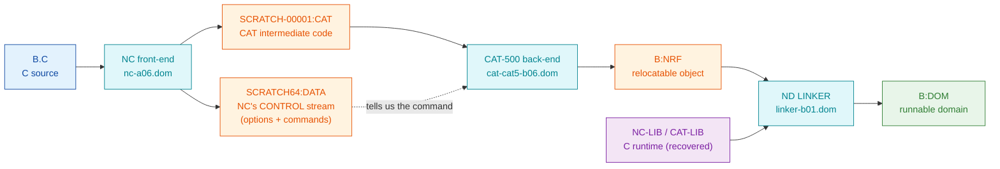

# Getting C to compile under nd500x: history, fixes, and lessons

**Full path of this document:** `/home/ronny/repos/nd500x/docs/SESSION_HISTORY_C_COMPILE_LINK_2026-07-15.md`

Started: 2026-07-15 (24 commits, `26f665d` .. `5b6bdfd`, all on `main`)
Last updated: 2026-07-15

> **THIS IS A LIVING DOCUMENT.** It is the running history of the C compile+link
> effort, not a one-off session write-up. **Append a new chapter as each phase
> lands** - see [section 8, How to extend this document](#8-how-to-extend-this-document),
> which defines the chapter template and the rules. Chapter 1 below covers the
> compile half (phases 0-1). The link half gets its own chapter when it lands.

Goal: compile a C source with the real Norsk Data C compiler and link it into a
runnable domain, entirely under the nd500x emulator.

**Chapter index**

| Chapter | Phase(s) | Subject | Status |
|---|---|---|---|
| 1 (sections 1-7) | 0-1 | C -> `:NRF` (NC front-end + CAT-500 back-end) | **DONE** 2026-07-15 |
| 2 (to be written) | 2-3 | `:NRF` -> `:DOM` (ND Linker; `MON 511B DVIO` + RSIO) | blocked, see 6 |
| 3 (to be written) | 4 | End-to-end compile+link+**run** (the DONE gate) | pending |
| 4 (to be written) | 5 | Finalise + release the C# cross-emulator handoff | pending |

---

# Chapter 1 - The compile half (phases 0-1)

**Headline result: the compile half now works.** A C file compiles to a real
`:NRF` object whose structure matches a genuine 1991 ND-500 object file. The link
half is not done, but its blocker is now a single named missing MON call rather
than a mystery, and the C runtime libraries - long believed lost - were found.

---

## 1. Where we were at the start

| Thing | Believed state (start of day) | Reality (end of day) |
|---|---|---|
| C -> `:NRF` | `BOUT.NRF` always 0 bytes; cause unknown | **WORKS.** Root cause was a real emulator bug (412B FSCNT) |
| The pipeline | 3 stages: `.C -> NC -> .NRF` | **4 stages.** NC is only a front-end; CAT-500 is the back-end that emits NRF |
| Linker input | "Command loop polls an in-memory datafield, no MON call involved - blocked on the carver's datafield spec" | **FALSE.** It is an ordinary MON call path. Blocker is `MON 511B DVIO`, unimplemented |
| C runtime libs | "`NC-LIB`/`CAT-LIB` absent from all media; must be located or fabricated" | **FALSE.** Both exist; they were inside a floppy image |
| 412B FSCNT | "Bookkeeping-only - THE critical blocker" (per the CAT-500 MON contract) | Already real; the actual defect was its **output parameter** |

Three of those five beliefs were wrong, and two of the wrong ones were recorded
in project memory as established fact. That is the single most important lesson
of the day (see section 5).

---

## 2. The pipeline, as it actually is



Stages A-F work today. Stage G is blocked (section 4.4).

Key artefacts, full paths:

| Artefact | Path |
|---|---|
| C front-end | `/mnt/d/ND/500/FraTor/nc/nc-a06.dom` ("Norsk Data C - Version: A06 - 1989-01-10") |
| CAT-500 back-end | `/mnt/d/ND/500/CAT5-CAT/cat-cat5-b06.dom` ("CAT-500 - Version B06 - 1988-01-05") |
| ND Linker | `/mnt/d/ND/500/nd-linker/linker-b01.dom` |
| Golden reference object | `/mnt/d/ND/500/FraTor/test-real/test-real.nrf` |
| Recovered C runtime | `/mnt/d/ND/500/c-libs/` (see section 4.3) |
| Vendor C link recipe | `/mnt/d/ND/500/nd-linker/linker-auto-c.job` |
| Link/compile recipe doc | `/mnt/d/ND/500/nd-linker/nd500-c-compile-and-link.md` |
| SINTRAN III L07 carve | `/mnt/e/Dev/Ronny/NDInsight/tools/sintran-segment-carver/versions/L-VSX-500/` |

---

## 3. What we set out to fix, and the false trails

The presenting symptom was simple: **`BOUT.NRF` is 0 bytes.** Getting from there
to the cause took a long chain of hypotheses. The wrong ones are recorded here
deliberately, because each was plausible and each would have produced a "fix"
that shipped a bug.

### 3.1 "NC crashes during code generation" - wrong
NC compiles cleanly. `/home/ronny/repos/nd500x/build/nc_sandbox/GUEST/B.LIST`
says `*** no errors detected ***`. NC is a **front-end only**; it never emits
NRF. It writes CAT intermediate code and asks the CAT-500 back-end to generate
the object. Nothing was crashing.

### 3.2 "CAT-500 prompts because 143B RSIO says interactive" - DISPROVEN by experiment
The carve documents `143B RSIO` as returning an execution mode
(`0=interactive, 1=batch, 2=mode job, 3=RT`), and nd500x hardcodes `0`. It was
very tempting: flip it to batch and CAT-500 stops prompting.

Ran the experiment behind an env override before changing behaviour. **Mode 0 and
mode 1 are byte-identical**: banner, `Cat-500:` prompt, 503B read, in both. The
lever was reverted. Committing it would have been a false fix that "worked" by
coincidence for nobody.

### 3.3 "The command dispatcher walks a corrupt record chain" - an artefact of MY OWN bug
A trace showed CAT-500 dereferencing `0x20202020` (four ASCII spaces) as a
pointer, in a loop. Compelling - and wrong. My dump helper read
`word_at(A) & 0xFF`, but **the ND-500 is big-endian**, so `byte[A]` is the HIGH
byte: `(word_at(A) >> 24) & 0xFF`. Every dump was shifted by 3 bytes, which made
a table of error-message strings look like binary records. With correct byte
order the region reads `"can't generate code"`, `"out of range"`,
`"exception handler missing"` - it is the message table, and the page-fault loop
was CAT-500's *error reporting path*, i.e. a symptom of the real failure.

### 3.4 "412B FSCNT returns a short read" - my own octal misread
`117B RFILE: IN: NoOfBytes=4000 ... OUT: Read 2048 bytes` looks like a bug.
It is not: **the MON logs print numbers in octal (`%o`)**. `4000`(8) = 2048, so
that is a full, correct read. Likewise `20000`(8) = 8192 = the real file size,
and file numbers `100`(8) = 64, `101`(8) = 65.

### 3.5 "321B UEADM / 413B FSCDNT are failing, fix those" - red herrings
Both genuinely return errors in the trace. Both occur **only after** the failure
message, on the cleanup path. Ordering the log by line number settled it in one
command. (413B's segment-number check is still worth fixing - just not for this.)

### 3.6 "NC A06 emits a CAT format CAT-500 B06 rejects" - killed by measurement
A real possibility: version skew, and the CAT header byte differs between
artefacts (`d6` vs `d0`). The memtrace killed it: across the **entire 11,102-read
code-generation window, CAT-500 read the mapped CAT file exactly ZERO times**. It
never looked at the input, so it could not have rejected its format.

### 3.7 "The linker is carver-blocked" - FALSE, and it was in memory as fact
Recorded as: "command loop polls an in-memory datafield (no MON), needs the
carver's datafield struct definitions; 3 open questions". The linker in fact does
an ordinary `1B INBT` on device 0, and later `MON 511B DVIO`. No carver input was
ever required.

### 3.8 "The C runtime libraries do not exist" - FALSE, and also in memory as fact
Recorded as: "ABSENT from all `/mnt/d/ND` media ... must be located or
fabricated". They were never missing - see section 4.3.

---

## 4. What we actually fixed

### 4.1 THE bug: `MON 412B FSCNT` never wrote its output parameter
**Commit `73ac594`.** File:
`/home/ronny/repos/nd500x/src/libmon/handlers/mon_412B_FileAsSegment.c`

`412B FSCNT` (FileAsSegment) takes **four** arguments -
`FileNo, LogSegmentNo, AccessType, @out SegNo` - the last being an indirect OUT
parameter that receives the assigned segment number. The handler ended with:

```c
/* Return assigned segment number in W1 */
ctx->set_error_code(ctx->cpu, (int32_t)assigned);
```

It left the value in W1 and **never wrote argument 3**. CAT-500's wrapper proves
the signature (from `/mnt/d/ND/500/CAT5-CAT/cat-cat5-b06.asm`):

```
0801F08B: call $0xFFFFFFFFF800010A,$0x4,b.0x14,b.0x18,b.0x1C,@b.0x20   ; 0x10A = 412B
```

Consequences, every one of them byte-observed:

- the caller kept the OUT cell's stale value, `0`;
- it therefore addressed **segment 0** and read zeros - 67 reads at
  `vaddr=0x00000000`;
- it **never read the real mapping** at `0x20000000` - 0 reads in the whole
  code-generation window;
- it failed with `*ERROR*   can't generate code` **without ever reading its
  input**;
- its later `413B FSCDNT(LogSegmentNo=0)` mismatched the real segment
  ("File 100 mapped to segment 5, not 0").

The fix is four lines:

```c
if (ctx->arg_count >= 4) {
    mon_write_param_word(ctx, 3, assigned);
}
```

Result:

```
Cat-500: generate-code
CAT file: SCRATCH-00001:CAT
object file: B:NRF
code generation : ok
programCAT_COMPILER terminated
```

`/home/ronny/repos/nd500x/build/nc_sandbox/GUEST/B.NRF` = **513 bytes**, header
`0a 00 01 70 44 ...` identical to the golden
`/mnt/d/ND/500/FraTor/test-real/test-real.nrf`, with real NRF symbol records
(`PROG!NAME`, `V!ARGC`, `X`). No regressions: MON suite 53/3 (same 3 pre-existing
failures), instruction validation 39791/12 (unchanged - the change touches only a
MON handler).

### 4.2 The CAT-500 command, read out of NC's own output
**Commits `20d8afe`, `cfa97e9`.**

We guessed `COMPILE`, `SCRATCH`, `check`, `xyzzy`. All wrong. The answer was
sitting in NC's own control stream,
`/home/ronny/repos/nd500x/build/nc_sandbox/SCRATCH/SCRATCH64.DATA`, in plain
text:

```
1234567890 / 1 / 0 / 0 / 1 / 1 / 75
options m2  a4  f-  r4  l+  d+  n+  s-  p-  i-  o-  pr- ic+ lm+ t-  a-  lo+
0 / 2 / SSI-CODE 438 / 1 / 37
generate-code,SCRATCH-00001:CAT,B:NRF          <-- THE COMMAND
```

So `SCRATCH64:DATA` is **not** the program - it is NC's control/command stream.
The CAT-code program is the separate `SCRATCH-00001:CAT`. CAT-500's dialogue is
`Cat-500: ` -> `CAT file: ` -> `object file: `; the comma form works too. `EXIT`
exits cleanly via `0B LEAVE`; `help` prints help.

Also learned: **NC creates the CAT file itself** (`221B CRALF 'SCRATCH-00001:CAT'`
-> `./SCRATCH/SCRATCH-00001.CAT`) and **deletes any pre-existing copy**, so
hand-substituting it is both unnecessary and futile.

### 4.3 The C runtime libraries: found, extracted, preserved
**Commit `2885344`.** Preserved at `/mnt/d/ND/500/c-libs/` (with a README).

They were never missing. They are **inside a floppy image**, so every `find` by
filename missed them. Grepping the *contents* of all 338 ND disk images found
them immediately:

```
/mnt/d/ND/Frode/Unique Start (5.25 inch)/Unique START part 2.img
  volume UNIQUE, user FLOPPY-USER
    NC-LIB-A06:NRF    101442 bytes   PRINTF SCANF MALLOC FREE FOPEN EXIT MEMCPY STRLEN ...
    CAT-LIB-B06:NRF   220885 bytes   SIN COSH SINH POWER R!REAL W!REAL
    USLIB3:NRF        522441 bytes
```

Versions match the toolchain exactly: `NC-LIB-**A06**` for NC A06,
`CAT-LIB-**B06**` for CAT-500 B06; internal records are dated
`NC-LIB-A06.FROM.890116` / `CAT-LIB-B06.FROM.890117` (16-17 Jan 1989).

No filesystem parser was needed - the existing tool read it:
`/home/ronny/repos/norskdata-ndfs/ndfs-c/build-local/ndtool` (`-i` info, `-t`
list, `-x` extract).

Two traps recorded for next time:
- **False positive:** a plain `grep NC-LIB` also matches inside
  `PLANC-LIB-F00`/`PLANC-LIB-H00`. Every hit in `/mnt/d/ND/SI1.img` is that, not
  the C library. Require `CAT-LIB`, or an `NC-LIB` not preceded by a letter.
  Scan script: `/home/ronny/repos/nd500x/test/scan_nd_images_for_libs.sh`.
- **Format:** library NRFs start directly with a module-name record and use
  **parity-set tag bytes** (`c8` = `0x48|0x80`, `c4`, `cd`), e.g.
  `c8 17 "NC-LIB-A06.FROM.890116$"`. Objects from CAT-500 start `0a 00 01 70 44`
  with parity unset. Whether the linker accepts both framings is **unverified** -
  suspect this first if the link later rejects the libraries.

### 4.4 The linker: blocker identified as `MON 511B DVIO`
**Commits `f038b1c`, `5b6bdfd`.**

The linker reads commands from **device 0** (the SINTRAN command buffer) -
`143B RSIO` reports `input=0`, then it polls `1B INBT` on device 0. It must be
fed (`mon_set_command_buffer`); harness:
`/home/ronny/repos/nd500x/test/diag_linkfeed.c`. But feeding device 0 forces
**batch mode** - the linker asks "Batch abortion (Yes,No)" and spins.

With `RSIO` reporting the terminal instead, the linker takes the correct
interactive path and immediately calls a MON we do not implement. Its own
disassembly (`/mnt/d/ND/500/nd-linker/linker-b01.dom.asm`) settles it:

```
B004AC90: call $0xFFFFFFFFF8000143,$0xE ,...   ; MON 503B DVINST (14 args, input only)   - have
B004ACAD: call $0xFFFFFFFFF8000144,$0x3 ,...   ; MON 504B DVOUTS ( 3 args, output only)  - have
B004ACBF: call $0xFFFFFFFFF8000149,$0x10,...   ; MON 511B DVIO   (16 args, FUSED out+in) - MISSING
B004ACD7: ifkret                                ; <- the reported PC is only this
```

`0x149` = 329 = **511 octal**, `0x10` = 16 args - exactly matching
"Unimplemented MON ? (UNKNOWN) with 16 args". The reported PC being a plain
`ifkret` is what made it look like garbage rather than a real gap.

A probe handler is committed at
`/home/ronny/repos/nd500x/src/libmon/handlers/mon_511B_DVIO.c`. It dumps the real
arguments (`ND500X_DVIO_DUMP=1`) and returns an error rather than faking success.
Captured:

```
arg[0]=1  DeviceNo (terminal)   arg[1]=2  NoOfBytes    arg[2] @output buffer   } = DVOUTS shape
arg[3] @input-side buffer/count  arg[4]=7  arg[5]=-1  arg[6..7]=0x20202020
arg[8]=0xB0001D48  arg[9]=0xB004D8DE  arg[10]=-1  arg[13]=3  arg[14]=12
```

**Deliberately not implemented:** the input-phase mapping (args 3..15). The count
fits `3 + (14 - 1 shared DeviceNo) = 16`, but that arithmetic is not proof, and a
wrong buffer/count mapping would corrupt the linker's input in a way that looks
like a linker bug.

### 4.5 Earlier in the same session (pre-existing context)
- `26f665d` - model SINTRAN blocking-read (`STOP_WAIT_INPUT`) instead of spinning
  on EOF; `7819a36` extends it to `503B DVINST`.
- `15ca5e9`, `b615586` - `317B UECOM` and `12B SETCM` pass their string as a
  `[Length:4][Pointer:4]` **descriptor**; we were reading the descriptor struct
  as raw text and getting `""`. Fixed with `mon_read_descriptor_string`. This is
  how "CAT-CAT5-B" became visible at all.
- `f353a40` - `ND500X_KEEP_SCRATCH` so scratch files survive for the next stage.
- `198dc90` - correct SCOPA/SSPAR per ND-05.009.4.

---

## 5. What we learned

### 5.1 Recorded "facts" decay, and wrong ones cost more than unknowns
Three beliefs in project memory were false: the carver-blocked linker, the
missing libraries, and (in the CAT-500 MON contract) "412B is bookkeeping-only,
the one hard blocker". Each had been true once, or had seemed true, and each was
steering work away from the real problem for weeks. A memory that says
"unknown" is cheap; a memory that confidently says something false is expensive.
**Re-verify a load-bearing claim before building on it**, especially one that
says "blocked" or "impossible".

### 5.2 The tempting fix is usually the wrong one
Four separate plausible fixes were rejected this session, each of which would
have compiled, shipped, and been wrong:
- 143B batch mode (disproven by experiment before changing behaviour),
- `RSIO input_dev=1` alone (correct-looking, useless without 511B - reverted twice),
- "fix" 321B/413B (cleanup-path red herrings),
- a 511B input mapping derived from `3 + 13 = 16` arithmetic (not built).

The discipline that worked: **run the experiment before the implementation**, and
when an experiment disproves the premise, the correct amount of code to write is
zero.

### 5.3 Measure before theorising - one memtrace killed three theories
Enabling read-tracing for exactly the code-generation window produced a table
that ended the format-skew, segment-convention, and record-corruption debates at
once:

| vaddr region | reads | meaning |
|---|---|---|
| `0x10xxxxxx` | 7107 | stack/frame |
| `0x08xxxxxx` | 3039 | CAT-500's own code+data |
| `0x18xxxxxx` | 889 | its GSWSP working segment |
| **`0x2xxxxxxx`** | **0** | **the mapped CAT input - never touched** |

"It never reads its input" is a fact that no amount of reasoning about NRF
version bytes could have produced.

### 5.4 The answer is usually in the artefacts, not in our heads
Every real breakthrough came from reading something the vendor wrote:
- the CAT-500 command was verbatim in NC's control stream;
- the C link recipe was in `linker-auto-c.job` (parity-encoded: mask `0x7F`);
- the linker's command set was in its own help and
  `/mnt/d/ND/500/nd-linker/nd500-c-compile-and-link.md`;
- the 511B gap was in the linker's own disassembly;
- the libraries were in a floppy image;
- the filesystem was readable by a tool that already existed (`ndtool`).

Guessing command names produced nothing. Reading the producer produced everything.

### 5.5 Instrument the instrument
Two of the day's most confusing hours were caused by defects in the diagnostics,
not the emulator:
- **big-endian dumps**: `word & 0xFF` is `byte[A+3]` on the ND-500; use
  `(word >> 24) & 0xFF`. This manufactured a fake "corrupt record chain".
- **octal logs**: `%o` in the MON logs manufactured a fake "short read".
- **invisible console**: `mon_queue_console_input()` installs a `ConsoleIO` whose
  `write_char` captures output into an internal buffer, so `504B DVOUTS` output
  is **invisible on stdout**. The prompts were being printed the whole time.
  Harnesses must print `mon_get_console_output()`.

When a trace shows something impossible, suspect the trace first.

### 5.6 Emulator gotchas worth remembering
- MON handlers with an OUT parameter must **write the parameter**, not just leave
  a value in a register. 412B is unlikely to be the only one; the audit is
  complicated by handlers that legitimately write into a caller-supplied *buffer*
  address instead (e.g. `41B ROBJE`), so a naive grep gives ~80 false positives.
- Do **not** register a handler `MON_STATUS_NOT_IMPLEMENTED`:
  `/home/ronny/repos/nd500x/src/libmon/mon_dispatch.c:173` short-circuits that
  status and never calls the handler. Use `MON_STATUS_IN_PROGRESS`.
- `AccessType=1` on 412B legitimately leaves the segment **zeroed**
  (1 = uninitialized/empty); CAT-500 maps the scratch to *write* it. Zeros there
  are correct, not a bug.
- Colon->dot filename mapping already works end to end
  (`SCRATCH-00001:CAT` -> `./SCRATCH/SCRATCH-00001.CAT`), including the
  `SCRATCH-` auto-routing rule in
  `/home/ronny/repos/nd500x/src/libmon/mon_path.c`.
- `MON 60B / N500M` (the ND-100 -> ND-500 gateway, 5IFUNC/FUNCS/3022 IOX/5MPM) is
  **off-path** for nd500x: we emulate only the ND-500 side and service its MON
  calls directly. It matters only if the ND-100 host half is ever emulated.

---

## 6. State at end of session

**Working (reproducible from `/home/ronny/repos/nd500x/build/nc_sandbox`):**

```
# 1. compile: produces GUEST/B.LIST ("no errors"), SCRATCH/SCRATCH-00001.CAT, SCRATCH/SCRATCH64.DATA
ND500X_PIN_CLOCK=1 ND500X_KEEP_SCRATCH=1 ../bin/diag_domload_v \
    /mnt/d/ND/500/FraTor/nc/nc-a06.dom "COMPILE B,B,B\r" 1400000

# 2. generate code: produces GUEST/B.NRF (513 bytes)
ND500X_PIN_CLOCK=1 ND500X_KEEP_SCRATCH=1 ../bin/diag_cat_record \
    /mnt/d/ND/500/CAT5-CAT/cat-cat5-b06.dom \
    'generate-code\rSCRATCH-00001:CAT\rB:NRF\r' 2000000
```

**Not working:** the link. Two coupled changes are required and must land
together:
1. implement `MON 511B DVIO` (prompt-then-read) - establish the input-phase
   argument mapping from evidence, then implement by **reusing** the existing
   `504B DVOUTS` + `503B DVINST` paths (do not duplicate them);
2. make `143B RSIO` report the **terminal** as command-input for interactive mode
   (`input_dev=1`, matching `output_dev=1` and `mode=0`; its own documented
   contract says "Terminal number for interactive").

Then drive the minimum session (prompt `NDL:`, `NDL(ADV):` after advanced mode):

```
OPEN-DOMAIN "B"    <- double quotes CREATE the file; default type :DOM
LOAD B             <- loads B:NRF; the first LOAD allocates a default segment
CLOSE              <- writes the symbol table AND pulls in the C runtime via the auto-job
EXIT               <- implicit CLOSE
```

Before `SET-ADVANCED-MODE` only eight commands exist: `CLOSE EXIT LIST-DOMAINS
LIST-ENTRIES LIST-STATUS LOAD OPEN-DOMAIN SET-ADVANCED-MODE`. The linker displays
addresses in **octal** by default. C needs NRF only, never BRF. Symbols are
lower-case - C is case-sensitive, do not normalise.

**Open questions (explicitly unresolved, do not assume):**
- the 511B input-phase argument mapping (args 3..15);
- whether the linker accepts the libraries' parity-set NRF framing;
- `413B FSCDNT` rejects `LogSegmentNo=0` ("File 100 mapped to segment 5, not 0") -
  real, but only on the cleanup path;
- `/mnt/d/ND/Frode/Unique Start (5.25 inch)/Unique START part 1.img` has not been
  examined - it may hold more of the runtime;
- the two `317B UECOM` mode variants (2 vs 4, a range test on `T`) are byte-visible
  in the carve but their meaning is **not** proven;
- `317B UECOM` still does not RUN the named subsystem nested. The carve proves
  UECOM is a synchronous execute-command-and-return, so a fully automatic
  NC -> CAT-500 flow still needs nested invocation; today the two stages are
  driven separately.

---

## 7. Cross-references

| Topic | Document |
|---|---|
| Carve analysis, MON 60B gateway, CAT-500 handshake | `/home/ronny/repos/nd500x/docs/CARVE_ANALYSIS_MON60_AND_HANDSHAKE.md` |
| C# emulator handoff (mirror the 412B fix there) | `/home/ronny/repos/nd500x/docs/CSHARP_HANDOFF_BLOCKING_READ_SESSION.md` |
| Recovered C runtime + provenance | `/mnt/d/ND/500/c-libs/README.md` |
| Compile+link recipe (vendor-derived) | `/mnt/d/ND/500/nd-linker/nd500-c-compile-and-link.md` |
| CAT-500 code analysis / MON contract | `/mnt/d/ND/500/CAT5-CAT/cat-cat5-b06-analysis.md`, `-MON-contract.md` |
| SINTRAN III L07 carve (MON ground truth) | `/mnt/e/Dev/Ronny/NDInsight/tools/sintran-segment-carver/versions/L-VSX-500/re/MON-CALL-INDEX.md` |
| SINTRAN on-disk format (for image work) | `/mnt/e/Dev/Ronny/NDInsight/SINTRAN/Filesystem/on-disk-format/README.md` |

Diagnostic harnesses added this session:

| Harness | Purpose |
|---|---|
| `/home/ronny/repos/nd500x/test/diag_cat_record.c` | CAT-500 tracer: PC ring buffer at failure, console-output dump, segment base probes |
| `/home/ronny/repos/nd500x/test/diag_linkfeed.c` | drives the linker by priming/refilling the SINTRAN command buffer |
| `/home/ronny/repos/nd500x/test/scan_nd_images_for_libs.sh` | scans all ND disk images for the C runtime libraries |
| `/home/ronny/repos/nd500x/test/diag_domload.c` | generic DOM load+run smoke test |

---

## 8. How to extend this document

This file is the **running history of the whole C compile+link effort**. Each
phase that lands gets **its own chapter appended below**, in the same shape as
Chapter 1. Do not rewrite earlier chapters to look clever in hindsight - correct
them only when they state something now known to be **false**, and say so
explicitly (see the rules).

### When to add a chapter
Add one when a phase reaches a real outcome: it lands, or it is definitively
blocked on something outside the emulator. Do not add a chapter for a day of
poking that changed nothing - add a dated bullet to the relevant open question
instead.

### Chapter template

```
# Chapter N - <subject> (phase(s) X-Y)

Dates: <start> .. <end>    Commits: <first> .. <last>

## N.1 Where we were
   The believed state at the start, as a table: belief vs reality.
   Call out any belief that turned out to be FALSE - that is the most
   valuable row in the table.

## N.2 What we set out to fix, and the false trails
   Every hypothesis that was plausible and WRONG, with how it died.
   This section is not optional and it is not self-flagellation: a
   rejected fix that would have shipped is worth more to the next
   reader than the fix that worked.

## N.3 What we actually fixed
   Per fix: the commit, the full file path, the byte-level evidence,
   the before/after, and the regression result.

## N.4 What we learned
   Durable lessons only - things that will still be true next month.
   Emulator gotchas, tooling traps, method that worked.

## N.5 State at end
   Reproducible commands. What works, what does not, and the
   explicitly-unresolved open questions.
```

### Rules

1. **Full absolute paths, always.** This document is read cold, by people and by
   future sessions, often across drives. Never a bare basename.
2. **Label evidence.** Byte-verified, observed, inferred, or unknown. If it was
   not read from actual bytes, a trace, or on-disk evidence, say so. Never fill a
   gap with a plausible story.
3. **Keep the false trails.** Section N.2 is the highest-value part of each
   chapter. Every wrong-but-tempting fix that got rejected is a landmine the next
   person does not step on.
4. **Correct falsehoods loudly.** When a chapter's claim is later disproven, do
   not silently edit it - mark it and point to the chapter that overturns it.
   Section 5.1 exists because confidently-wrong records cost weeks.
5. **Update the chapter index and `Last updated:`** at the top.
6. **Mirror the durable findings** into project memory
   (`/home/ronny/.claude/projects/-home-ronny-repos-nd500x/memory/`) and, when
   they are cross-emulator facts, into
   `/home/ronny/repos/nd500x/docs/CSHARP_HANDOFF_BLOCKING_READ_SESSION.md`.
7. **No Unicode** in anything destined for the ND toolchain (C source, assembler,
   guest files) - those tools are from the late 1980s.

### Next chapter, already scoped
Chapter 2 (phases 2-3, `:NRF` -> `:DOM`) should open with the two coupled changes
in [section 6](#6-state-at-end-of-session) - `MON 511B DVIO` and the `143B RSIO`
terminal-input fix - and must record how the 511B **input-phase argument mapping**
was finally established, since this chapter deliberately refused to guess it.
